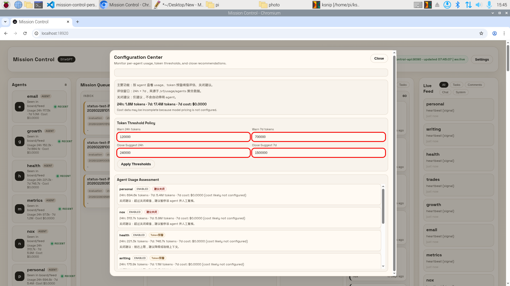
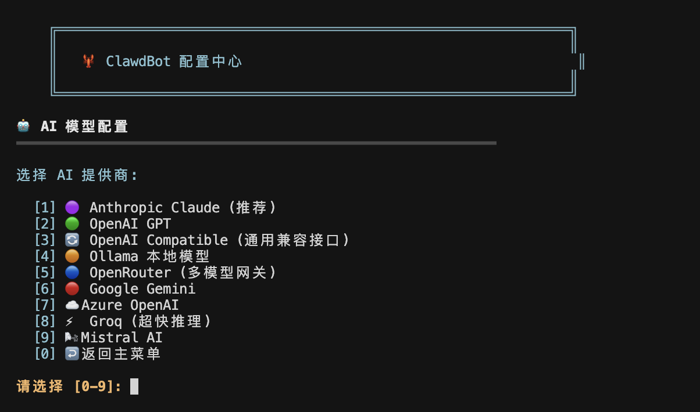
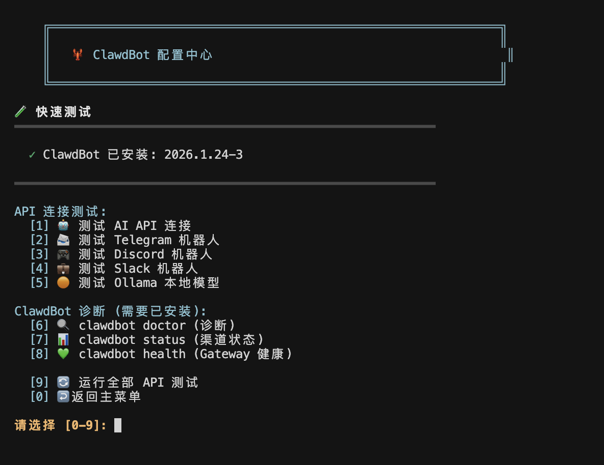
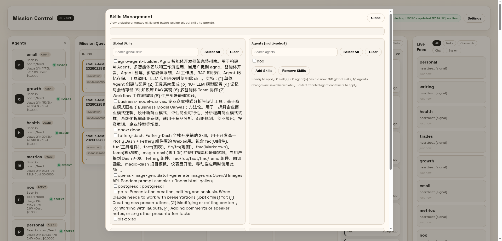
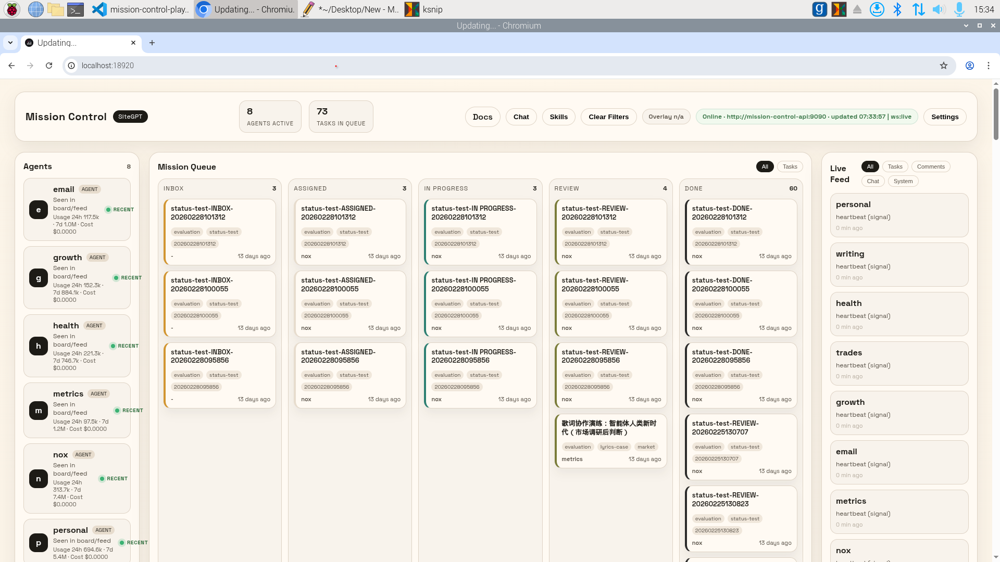
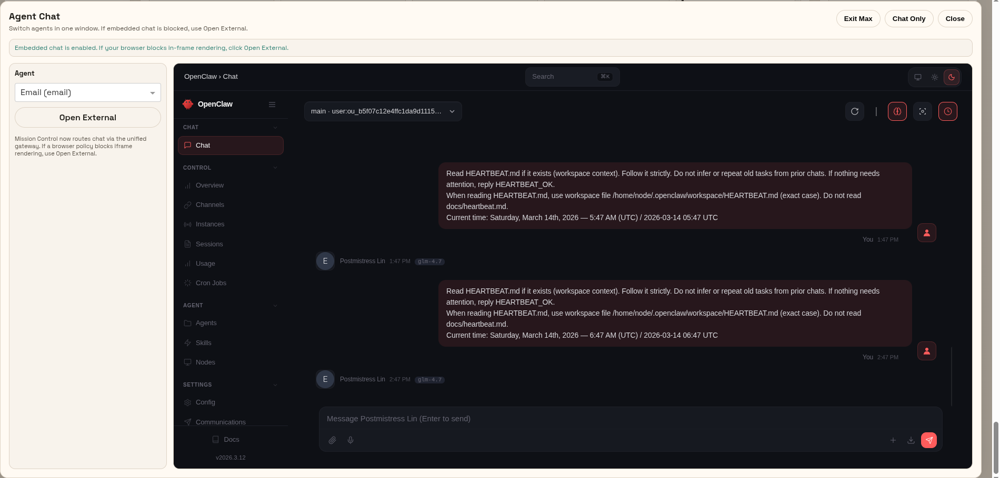

# 🦞 OpenClaw-PWTInstaller

<p align="center">
  
  
  
</p>

> 🚀 以 PWT（个人全景监控）为核心理念，构建你专属的 OpenClaw 多 Agent 生活操作系统

<p align="center">
  
</p>

## 📖 目录

- [项目理念（PWT）](#-项目理念pwt)
- [系统要求](#-系统要求)
- [运行模式总览](#-运行模式总览)
- [灵感来源与方法论](#-灵感来源与方法论)
- [快速开始](#-快速开始)
- [功能特性](#-功能特性)
- [仓库结构速览](#-仓库结构速览)
- [详细配置](#-详细配置)
- [常用命令](#-常用命令)
- [配置说明](#-配置说明)
- [安全建议](#-安全建议)
- [常见问题](#-常见问题)
- [更新日志](#-更新日志)

## 🧭 项目理念（PWT）

`OpenClaw-PWTInstaller` 不只是安装脚本，而是一套把 OpenClaw 升级为 **个人 AI 基础设施** 的落地方案。

这里的 **PWT（个人全景监控）** 指的是：

- **持续可见**：把分散在邮件、日程、财务、健康、交易、写作等系统的信息流，收敛成可行动上下文
- **并行协作**：用多 Agent 长时分工运行，不同目录承担不同职责，必要时通过 handoff 传递上下文
- **自动闭环**：通过定时任务、状态检查、通知回执，让任务从“被动响应”升级为“持续演进”
- **人保留决策权**：系统负责观察、归纳、建议，人始终位于系统之外的 meta 层

### ✅ 软约束（行为契约）：8-Agent SOUL「PWT 工作契约」

为了让这 4 条理念长期可执行，本仓库在 8-Agent Panopticon 的 **每个 Agent workspace** 中维护 SOUL.md，并补充了 `PWT 工作契约（责任＝数据边界＝权限边界）`：

- 明确 **职责边界**（我负责什么 / 不负责什么）
- 明确 **数据边界**（只在本 workspace 读写，跨域用显式 handoff）
- 强制 **持续可见**（任务产物落盘：artifacts/sources/state，可审计可回放）
- 约定 **自动闭环**（checkpoint + 心跳只做 I/O，无事 HEARTBEAT_OK）
- 约定 **Review Gate**（所有外部副作用/高风险动作默认进入 Review）

> 说明：这是一套“软约束”。它能降低越权与失控风险，但不等同于系统层面的“硬限制”。硬限制仍需通过容器隔离、配置与权限控制落实。

> 💡 目标不是“把人生交给 AI”，而是“把人生重新看清楚，并掌握在自己手里”。

## 💻 系统要求

开始前先确定运行形态：桌面版适合快速上手，命令行版适合自动化与长期运行。

| 项目 | 要求 |
|------|------|
| 命令行版（本仓库） | macOS 12+ / Ubuntu 20.04+ / Debian 11+ / CentOS 8+ |
| 桌面版 OpenClaw Manager | Windows / macOS / Linux |
| Node.js | v22 或更高版本 |
| Docker / Docker Compose | 使用 8-Agent Panopticon 时需要 |
| Python 3 | 使用 `panopticon/tools/*.py` 生成/校验工具时建议安装 |
| 内存 | 最低 2GB，推荐 4GB+ |
| 磁盘空间 | 单 Agent 最低 1GB；8-Agent + Mission Control 建议 5GB+ |

## 🗺️ 运行模式总览

本仓库覆盖从单 Agent 到 8-Agent Panopticon 的完整路径，建议先确定模式再继续阅读。

> **当前主路线声明（2026-03）**
> - **主推路线**：`8-Agent Panopticon + Mission Control`（平台化、长期运行、多 Agent 协作）。
> - **次要路线**：`单 Agent 命令行安装器`（快速上手、轻量使用）。
> - **实验性路线**：根目录 `docker-compose.yml` 单容器部署（非主推，不作为生产默认路径）。

| 模式 | 适合谁 | 入口 | 当前仓库状态 |
|------|--------|------|--------------|
| 桌面版 Manager | 想快速上手、偏 GUI | OpenClaw Manager | 推荐新用户优先使用 |
| 单 Agent 命令行 | 想先跑通 OpenClaw 并配置模型/渠道 | `install.sh` + `config-menu.sh` | 已可直接使用 |
| 8-Agent Panopticon | 想长期运行多角色 Agent，并接入 Mission Control | `panopticon/docker-compose.panopticon.yml` | 已提供 compose、env、模板与校验工具 |
| 根目录 Docker 单容器 | 想做快速容器实验或本地临时验证 | `docker-compose.yml` | **实验性（非主推）** |
| Mission Control 开发 | 想二次开发控制台、事件流与任务面板 | `mission_control_api/` + `MissionControl/` | API / UI / WS / Chat 代理已接入 Panopticon 编排 |

首次接触 OpenClaw，可先完成“单 Agent 命令行版”；如果目标是 PWT / 多 Agent 长时运行，建议直接按主路线阅读本页 Panopticon 章节与 [panopticon/README.md](panopticon/README.md)。

## 🧩 灵感来源与方法论

这个项目的方法论，来自成熟的 Agent Native 实践：

- 使用 8 个并行 Agent 实例，按领域长期运行（产品、指标、邮件、增长、交易、健康、写作、个人事务）
- 复杂任务由短期子代理处理，跨域需求通过显式 handoff 协作
- 任务在夜间和移动场景持续执行，完成后通过通知机制进行 checkpoint
- 保留思考轨迹与执行记录，用于递归迭代与系统自我改进

`OpenClaw-PWTInstaller` 的目标，是把这套能力沉淀成每个人都能复现的安装、配置与编排流程。

## 🚀 快速开始

按你的目标选择入口：想快速上手先用桌面版，想持续运行再用命令行版或 8-Agent 编排。

### 🖥️ 桌面版 OpenClaw Manager（推荐）

如果你更喜欢图形界面，推荐使用 **OpenClaw Manager** 桌面应用：

<p align="center">
  <a href="https://github.com/miaoxworld/openclaw-manager">
    
  </a>
</p>

- 🎨 **现代化 UI** - 基于 Tauri 2.0 + React + TypeScript + Rust 构建
- 📊 **实时监控** - 仪表盘查看服务状态、内存、运行时间
- 🔧 **可视化配置** - AI 模型、消息渠道一键配置
- 💻 **跨平台** - 支持 macOS、Windows、Linux

👉 **下载地址**: [github.com/miaoxworld/openclaw-manager](https://github.com/miaoxworld/openclaw-manager)

---

### 方式一：一键安装（命令行版，仅 macOS / Linux）

```bash
curl -fsSL https://raw.githubusercontent.com/Ieer/OpenClaw-PWTInstaller/main/install.sh | bash
```

安装脚本会自动：
1. 检测系统环境并安装依赖
2. 安装 OpenClaw
3. 引导完成核心配置（AI模型、身份信息）
4. 测试 API 连接
5. **自动启动 OpenClaw 服务**
6. 可选打开配置菜单继续配置渠道等项

### 方式二：手动安装（命令行版，仅 macOS / Linux）

```bash
# 1. 克隆仓库
git clone https://github.com/Ieer/OpenClaw-PWTInstaller.git
cd OpenClaw-PWTInstaller

# 2. 添加执行权限
chmod +x install.sh config-menu.sh

# 3. 运行安装脚本
./install.sh

# 如果 macOS 上遇到 npm 权限问题，可先手动安装 OpenClaw 再执行安装脚本
npm install -g openclaw
```

### 方式三：8-Agent Panopticon（Docker Compose，高级）

如果你的目标不是单个助手，而是 **Mission Control + 8 个长期运行 Agent**，建议直接使用仓库内置的 Panopticon 编排。

最短路径如下：

```bash
# 1. 可选：设置独立数据目录
cp panopticon/.env.example panopticon/.env

# 1.1 可选（普通 U 盘推荐）：初始化知识原始资料目录
bash panopticon/tools/init_usb_knowledge_sources.sh

# 2. 编辑各 agent 的环境变量（至少模型、API Key、Gateway Token）
$EDITOR panopticon/env/nox.env
$EDITOR panopticon/env/metrics.env
$EDITOR panopticon/env/email.env

# 3. 启动整套 8-Agent + Mission Control
docker compose -f panopticon/docker-compose.panopticon.yml up -d
```

启动后主要入口：

- **Mission Control UI**：`http://127.0.0.1:18920/`
- **同源 Chat 入口**：`http://127.0.0.1:18920/chat/nox/`
- **Mission Control API**：`http://127.0.0.1:18910/health`

> 💡 建议：在 8-Agent Panopticon 模式下，优先从 `18920` 的同源入口访问 Chat，不要直接打开 `188xx` 端口，可减少 `token missing`、`1008`、`pairing required` 等问题。

### 方式四：根目录 Docker 单容器（实验性，非主推）

根目录 `docker-compose.yml` 仅用于单容器快速实验/本地临时验证，不作为当前仓库主路线。

```bash
docker compose up -d
docker compose logs -f --tail=200
```

> ⚠️ 提示：若你的目标是稳定运行 Mission Control + 多 Agent，请改用 `panopticon/docker-compose.panopticon.yml`。

### 安装完成后

安装完成后，脚本会：
1. **自动询问是否启动服务**（推荐选择 Y）
2. 后台启动 OpenClaw Gateway
3. 可选打开配置菜单继续配置渠道

建议立即做一次最小验证：

```bash
# 查看模型/鉴权是否就绪
openclaw models status

# 健康检查
openclaw health

# 查看带 token 的控制台入口
openclaw dashboard --no-open
```

后续可用以下方式管理：

```bash
# 手动启动服务
source ~/.openclaw/env && openclaw gateway

# 后台启动服务
openclaw gateway start

# 运行配置菜单进行详细配置（如果你当前就在仓库目录）
bash ./config-menu.sh

# 或从 GitHub 下载后直接运行（任意目录可用）
curl -fsSL https://raw.githubusercontent.com/Ieer/OpenClaw-PWTInstaller/main/config-menu.sh | bash
```

## ✨ 功能特性

以下能力围绕 PWT 设计：让信息可见、动作可执行、系统可迭代。

<p align="center">
  
</p>

<p align="center"><em>配置中心：查看管理ｔｏｋｅｎ </em></p>

### 🤖 多模型支持

<p align="center">
  
</p>

**主流服务商:**
- **Anthropic Claude** - claude-sonnet-4-5 / claude-opus-4-5 / claude-haiku-4-5 *(支持自定义 API 地址)*
- **OpenAI GPT** - gpt-4o / gpt-4o-mini / gpt-4-turbo *(支持自定义 API 地址，需支持 v1/responses)*
- **Google Gemini** - gemini-2.0-flash / gemini-1.5-pro / gemini-1.5-flash

**多模型网关:**
- **OpenRouter** - 多模型网关，一个 Key 用遍所有模型 (claude-sonnet-4 / gpt-4o / gemini-pro-1.5)

**快速推理:**
- **Groq** - 超快推理，llama-3.3-70b-versatile / llama-3.1-8b-instant / mixtral-8x7b
- **Mistral AI** - mistral-large-latest / mistral-small-latest / codestral-latest

**本地部署:**
- **Ollama** - 本地部署，无需 API Key (llama3 / llama3:70b / mistral)

> 💡 **自定义 API 地址**: Anthropic Claude 和 OpenAI GPT 都支持自定义 API 地址，可接入 OneAPI/NewAPI/API 代理等服务。配置时先输入自定义地址，再输入 API Key。
>
> ⚠️ **OpenAI 中转要求**: 自定义 OpenAI API 地址必须支持 `v1/responses` 路径（OpenAI Responses API），不仅仅是传统的 `v1/chat/completions`。请确认您的中转服务已支持此接口。

### 📱 多渠道接入

<p align="center">
  
</p>

- Telegram Bot
- Discord Bot
- WhatsApp
- Slack
- 微信 (WeChat)
- iMessage (仅 macOS)
- 飞书 (Feishu)

### 🧪 快速测试

<p align="center">
  
</p>

- API 连接测试
- 渠道连接验证
- OpenClaw 诊断工具

### 🧠 核心能力
- **持久记忆** - 跨对话、跨平台的长期记忆
- **主动推送** - 定时提醒、晨报、告警通知
- **技能系统** - 通过 Markdown 文件定义自定义能力
- **远程控制** - 可执行系统命令、读写文件、浏览网络

<p align="center">
  
</p>

<p align="center"><em>技能管理：集中维护技能列表、能力边界与可复用工作流。</em></p>

### 🕸️ Panopticon / Mission Control 能力

进入 8-Agent Panopticon 模式后，仓库还提供：

- **8 个隔离 Agent 容器** - `nox / metrics / email / growth / trades / health / writing / personal`
- **Mission Control API** - 健康检查、任务板、评论、事件流、技能映射、usage 聚合、同源 Chat 代理
- **Mission Control UI** - 面板、状态卡、实时 feed、内嵌 Chat、Settings / Skills 弹窗与语音 overlay
- **统一同源网关** - 通过 `mission-control-gateway` 聚合 `/` 与 `/chat/<agent>/`
- **模板与校验工具** - manifest 生成、workspace 骨架、skills 校验、契约测试

<p align="center">
  
  
</p>

<p align="center"><em>左侧为 Mission Control 总控视图，右侧为同源 Agent Chat 对话入口。</em></p>

## 📚 文档

如果你想从“能用”走向“用得深”，建议按以下顺序阅读：

> 文档权威源约定：
> - **当前运行方式 / 端口 / 服务组成**：以本页与 [panopticon/README.md](panopticon/README.md) 以及实际 compose 文件为准。
> - **Mission Control 工程说明**：以 [docs/mission-control-playbook-zh-cn.md](docs/mission-control-playbook-zh-cn.md) 为准；其中“扩展方向”不等同于“默认已启用”。
> - **英文 overview**：用于补充设计背景与目标态，不作为当前实现状态的唯一依据。

- Docs 索引与分工说明：[docs/README.md](docs/README.md)
- `openclaw.json` 新手配置说明（简中，含本地 Ollama 示例）：[docs/openclaw-json-guide-zh-cn.md](docs/openclaw-json-guide-zh-cn.md)
- 理念延伸：个人全景监控与 8-Agent 方法论（繁中）：[docs/mission-control-personal-panopticon-zh-hant.md](docs/mission-control-personal-panopticon-zh-hant.md)
- 8-Agent 运行编排（Panopticon）：[panopticon/README.md](panopticon/README.md)
- 工程落地手册（简中，8-agent，含当前实现与扩展边界）：[docs/mission-control-playbook-zh-cn.md](docs/mission-control-playbook-zh-cn.md)
- Mission Control 通用实现参考（英文，偏设计背景与目标态）：[docs/mission-control-overview-en.md](docs/mission-control-overview-en.md)

每个 Agent 的 SOUL / 契约建议通过“模板与骨架”统一维护：

- 文档基线模板：[panopticon/templates/workspace-doc-baseline.md](panopticon/templates/workspace-doc-baseline.md)
- 可复制骨架包：[panopticon/templates/workspace-skeleton/README.md](panopticon/templates/workspace-skeleton/README.md)
- 一键脚手架：[panopticon/tools/scaffold_workspace_docs.py](panopticon/tools/scaffold_workspace_docs.py)

## 🗂️ 仓库结构速览

如果你准备长期维护这套系统，建议先理解目录边界：

| 路径 | 作用 | 什么时候看它 |
|------|------|--------------|
| `install.sh` | 单 Agent 一键安装脚本 | 首次安装命令行版 |
| `config-menu.sh` | 交互式配置中心 | 配模型、渠道、测试连接 |
| `panopticon/` | 8-Agent 编排、模板、env、数据目录约定 | 搭建 PWT / 多 Agent 长时运行 |
| `docker-compose.yml` | 根目录单容器 Docker 路径（实验性） | 仅做本地快速容器实验 |
| `mission_control_api/` | Mission Control 后端 | 需要任务板、事件流、API 二次开发 |
| `MissionControl/` | Mission Control 前端界面 | 需要控制台 UI、面板与嵌入聊天 |
| `docs/` | 理念、方法论、工程手册 | 需要理解整体设计与治理边界 |
| `external/OpenClaw-Docker-CN-IM/` | 参考/复用的 OpenClaw Docker 基底 | 排查容器启动、env→json 生成逻辑 |
| `tools/` | 辅助测试脚本 | 做专项测试或排查性能问题 |

推荐阅读顺序：

1. **想先用起来**：本页 → `install.sh` / `config-menu.sh`
2. **想走主路线（推荐）**：本页 → [panopticon/README.md](panopticon/README.md)
3. **想先看懂配置文件**：本页 → [docs/openclaw-json-guide-zh-cn.md](docs/openclaw-json-guide-zh-cn.md)
4. **想理解治理/契约**：本页 → [docs/mission-control-playbook-zh-cn.md](docs/mission-control-playbook-zh-cn.md) → [docs/mission-control-personal-panopticon-zh-hant.md](docs/mission-control-personal-panopticon-zh-hant.md)
5. **想改控制台**：本页 → [docs/mission-control-playbook-zh-cn.md](docs/mission-control-playbook-zh-cn.md) → [mission_control_api/README.md](mission_control_api/README.md) → `MissionControl/app.py`

## ⚙️ 详细配置

首次安装完成后，这一章会帮助你把系统从“能跑”推进到“能长期运行”。

### 配置 AI 模型

打开配置菜单后选择 `[2] AI 模型配置`，即可配置不同 AI 提供商：

<p align="center">
  
</p>

#### Anthropic Claude 配置

1. 在配置菜单中选择 Anthropic Claude
2. **先输入自定义 API 地址**（留空使用官方 API）
3. 输入 API Key（官方 Key 从 [Anthropic Console](https://console.anthropic.com/) 获取）
4. 选择模型（推荐 claude-sonnet-4-5-20250929）

> 💡 支持 OneAPI/NewAPI 等第三方代理服务，只需填入对应的 API 地址和 Key

#### OpenAI GPT 配置

1. 在配置菜单中选择 OpenAI GPT
2. **先输入自定义 API 地址**（留空使用官方 API）
3. 输入 API Key（官方 Key 从 [OpenAI Platform](https://platform.openai.com/) 获取）
4. 选择模型

> ⚠️ **中转服务要求**: 如使用自定义 API 地址，中转服务必须支持 OpenAI 的 **Responses API** (`v1/responses` 路径)，而非仅支持传统的 Chat Completions API (`v1/chat/completions`)。部分老旧或功能不全的中转服务可能不支持此接口，请提前确认。

> 💡 **其他模型**：配置菜单还支持 Google Gemini、OpenRouter、Groq、Mistral AI、Ollama，按提示配置即可。

### 配置 Telegram 机器人

1. 在 Telegram 中搜索 `@BotFather`
2. 发送 `/newbot` 创建新机器人
3. 设置机器人名称和用户名
4. 复制获得的 **Bot Token**
5. 搜索 `@userinfobot` 获取你的 **User ID**
6. 在配置菜单中选择 Telegram，输入以上信息

### 配置 Discord 机器人

**第一步：创建 Discord 应用和机器人**

1. 访问 [Discord Developer Portal](https://discord.com/developers/applications)
2. 点击 "New Application" 创建新应用
3. 进入应用后，点击左侧 "Bot" 菜单
4. 点击 "Reset Token" 生成并复制 **Bot Token**
5. ⚠️ **开启 "Message Content Intent"**（重要！否则无法读取消息内容）

**第二步：邀请机器人到服务器**

1. 点击左侧 "OAuth2" → "URL Generator"
2. Scopes 勾选：`bot`
3. Bot Permissions 至少勾选：
   - View Channels（查看频道）
   - Send Messages（发送消息）
   - Read Message History（读取消息历史）
4. 复制生成的 URL，在浏览器打开并选择服务器
5. 确保机器人在目标频道有权限

**第三步：获取频道 ID**

1. 打开 Discord 客户端，进入 "用户设置" → "高级"
2. 开启 "开发者模式"
3. 右键点击你想让机器人响应的频道
4. 点击 "复制频道 ID"

**第四步：在配置菜单中配置**

在配置菜单中选择 Discord，输入 Bot Token 和 Channel ID

### 配置飞书机器人

> 📖 **详细文档**: 查看 [飞书接入指南（OpenClaw，简中）](docs/feishu-setup-zh-cn.md) 获取完整的配置说明和常见问题解答。

> 💡 **无需公网服务器**：OpenClaw 使用飞书的 WebSocket 长连接模式接收事件，无需配置 Webhook 地址。

1. 访问 [飞书开放平台](https://open.feishu.cn/)
2. 创建企业自建应用（个人账号即可，无需企业认证）
3. **添加机器人能力**：
   - 进入路径：开发者后台 → 应用详情 → 添加应用能力
   - 确认：确保"机器人"开关是打开状态
4. 获取 **App ID** 和 **App Secret**
5. 在"权限管理"中添加权限：
   - `im:message` (收发消息)
   - `im:message:send_as_bot` (发送消息)
   - `im:chat:readonly` (读取会话信息)
6. 发布应用：版本管理与发布 → 创建版本 → 发布
7. **在配置菜单中配置飞书**：输入 App ID 和 App Secret，启动 OpenClaw 服务
8. 配置"事件订阅"（使用长连接）：
   - 进入：事件与回调 → 选择「**使用长连接接收事件**」
   - 添加事件：`im.message.receive_v1`（接收消息）
   - **无需填写 Webhook 地址**
   - ⚠️ **注意**：需要 OpenClaw 服务已启动，才能保存长连接设置
9. 添加机器人到群组：群设置 → 群机器人 → 添加机器人

### 配置 WhatsApp

> 💡 **无需 Business API**：OpenClaw 通过扫码登录你的 WhatsApp 账号，无需申请 Business API。

1. 在配置菜单中选择 `[3] 消息渠道配置` → `[3] WhatsApp`
2. 系统会自动启用 WhatsApp 插件
3. 扫描终端显示的二维码完成登录
4. 登录成功后重启 Gateway 使配置生效
5. **测试**：用自己的 WhatsApp 给自己发消息即可触发机器人回复

> ⚠️ **注意**：WhatsApp 账号只能在一个设备上登录 Web 版，配置后原有的 WhatsApp Web 会被踢下线。

## 📝 常用命令

以下命令覆盖日常最常用的管理操作。

### 服务管理

```bash
# 启动服务（后台守护进程）
openclaw gateway start

# 停止服务
openclaw gateway stop

# 重启服务
openclaw gateway restart

# 查看服务状态
openclaw gateway status

# 前台运行（用于调试）
openclaw gateway

# 查看日志
openclaw logs

# 实时日志
openclaw logs --follow
```

### 配置管理

```bash
# 打开配置文件
openclaw config

# 运行配置向导
openclaw onboard

# 诊断配置问题
openclaw doctor

# 健康检查
openclaw health
```

### 数据管理

```bash
# 导出对话历史
openclaw export --format json

# 清理记忆
openclaw memory clear

# 备份数据
openclaw backup
```

### Panopticon / Mission Control 管理

```bash
# 启动 8-Agent + Mission Control
docker compose -f panopticon/docker-compose.panopticon.yml up -d

# 停止整套服务
docker compose -f panopticon/docker-compose.panopticon.yml down

# 查看服务状态
docker compose -f panopticon/docker-compose.panopticon.yml ps

# 查看日志
docker compose -f panopticon/docker-compose.panopticon.yml logs -f --tail=200

# 仅重建同源网关（常用于 1008 / token 问题排查后）
docker compose -f panopticon/docker-compose.panopticon.yml up -d --force-recreate mission-control-gateway
```

### Panopticon 重启顺序（避免 502）

当你重建或重启 `mission-control-ui`（尤其 `--build` 后），建议固定执行：

```bash
# 1) 先重建 API/UI
docker compose -f panopticon/docker-compose.panopticon.yml up -d --build mission-control-api mission-control-ui

# 2) 再强制重建网关（关键）
docker compose -f panopticon/docker-compose.panopticon.yml up -d --force-recreate mission-control-gateway

# 3) 快速验收
curl -I http://localhost:18920/
curl -fsS http://127.0.0.1:18910/health
```

原因：`mission-control-ui` 容器 IP 变化后，`mission-control-gateway` 可能仍指向旧 upstream，表现为 `502 Bad Gateway`（常见在 `/_dash-update-component`）。

## 📋 配置说明

这部分说明 OpenClaw 的配置分层，帮助你区分“哪些需要手动管理，哪些交给系统处理”。

OpenClaw 使用以下配置方式：

- **环境变量**: `~/.openclaw/env` - 存储 API Key 和 Base URL
- **OpenClaw 配置**: `~/.openclaw/openclaw.json` - OpenClaw 内部配置（自动管理）
- **命令行工具**: `openclaw config set` / `openclaw models set` 等

> 💡 **注意**：配置主要通过安装向导或 `config-menu.sh` 完成，无需手动编辑配置文件

### Panopticon 配置分层

如果你使用 8-Agent Panopticon，建议把配置理解为 4 层：

1. **编排层**：`panopticon/agents.manifest.yaml`
  - 定义 Agent 名单、角色、端口和 token 占位。
2. **运行层**：`panopticon/docker-compose.panopticon.yml`
  - 实际容器编排文件；通常由 manifest / 生成器产出，不建议手改。
3. **环境层**：`panopticon/env/*.env` 与 `panopticon/env/*.env.example`
  - 每个 Agent / Mission Control 的模型、密钥、Gateway Token、事件上报配置。
4. **数据层**：`PANOPTICON_DATA_DIR`
  - 运行态数据根目录，承载 `agent-homes/`、`workspaces/`、`mission-control/`。

Mission Control 数据层初始化已改为 **Alembic 迁移优先**：

- `mission-control-api` 启动时会先执行 `alembic upgrade head`。
- 应用不再依赖启动期兜底建表逻辑。
- Postgres 不再通过 `docker-entrypoint-initdb.d` 挂载 SQL 作为默认 schema 来源。

### Mission Control 零停机迁移 SOP（生产）

> 目标：在不中断整体服务的前提下完成 schema 演进。原则是 **先兼容、再切流、最后清理**。

#### 0) 适用前提

- 迁移必须是向后兼容的第一阶段变更（例如：加表/加列/加索引，不直接删列改类型）。
- 应用代码应遵循 expand/contract 策略：先发布兼容新旧 schema 的版本，再做收缩型迁移。

#### 1) 预检查（必须通过）

```bash
# 进入仓库根目录
cd /home/pi/OpenClaw-PWTInstaller

# 1) 关键服务健康
docker compose -f panopticon/docker-compose.panopticon.yml ps
curl -fsS http://127.0.0.1:18910/health

# 2) 查看当前迁移位点与历史
docker compose -f panopticon/docker-compose.panopticon.yml exec mission-control-api alembic current
docker compose -f panopticon/docker-compose.panopticon.yml exec mission-control-api alembic history -v

# 3) 备份数据库（生产强制）
mkdir -p backups
docker compose -f panopticon/docker-compose.panopticon.yml exec -T mc-postgres \
  pg_dump -U mission_control -d mission_control > backups/mission_control_$(date +%F_%H%M%S).sql
```

#### 2) 迁移执行（零停机流程）

```bash
# 1) 构建最新 mission-control-api 镜像（包含迁移脚本）
docker compose -f panopticon/docker-compose.panopticon.yml build mission-control-api

# 2) 先执行迁移（可重复执行，幂等）
docker compose -f panopticon/docker-compose.panopticon.yml run --rm mission-control-api alembic upgrade head

# 3) 验证迁移位点
docker compose -f panopticon/docker-compose.panopticon.yml run --rm mission-control-api alembic current

# 4) 仅滚动更新 API（最小影响面）
docker compose -f panopticon/docker-compose.panopticon.yml up -d mission-control-api
```

#### 3) 迁移后验证（必须执行）

```bash
# API 健康
curl -fsS http://127.0.0.1:18910/health

# 基础功能探活
curl -fsS http://127.0.0.1:18910/v1/boards/default > /dev/null
curl -fsS "http://127.0.0.1:18910/v1/feed-lite?limit=5" > /dev/null

# 网关侧探活
curl -I http://127.0.0.1:18920/
curl -I http://127.0.0.1:18920/chat/nox/
```

#### 4) 生产回滚步骤（失败时）

```bash
# A. 先回滚应用版本（快速止血）
docker compose -f panopticon/docker-compose.panopticon.yml up -d mission-control-api

# B. 若需要回滚 schema（仅在迁移脚本提供 downgrade 且评估通过时执行）
docker compose -f panopticon/docker-compose.panopticon.yml run --rm mission-control-api alembic downgrade -1

# C. 验证回滚后的位点
docker compose -f panopticon/docker-compose.panopticon.yml run --rm mission-control-api alembic current
docker compose -f panopticon/docker-compose.panopticon.yml run --rm mission-control-api alembic history -v
```

如果 downgrade 不安全或不可逆，使用备份恢复：

```bash
# 以最新备份文件为例恢复
cat backups/mission_control_<timestamp>.sql | \
  docker compose -f panopticon/docker-compose.panopticon.yml exec -T mc-postgres \
  psql -U mission_control -d mission_control
```

#### 5) 发布门禁建议

- 每次发布必须附带：迁移脚本、`alembic history -v` 输出、回滚说明。
- 禁止在 `mission_control_api/app/main.py` 恢复运行期 DDL 兜底逻辑。
- 收缩型迁移（删列/改类型）应放在后续独立窗口执行，不与功能发布同批上线。

一句话：**改 Agent 名单与端口看 manifest；改模型与密钥看 env；改运行态数据位置看 `.env` / `PANOPTICON_DATA_DIR`。**

### 环境变量配置示例

`~/.openclaw/env` 文件内容：

```bash
# OpenClaw 环境变量配置
export ANTHROPIC_API_KEY=sk-ant-xxxxx
export ANTHROPIC_BASE_URL=https://your-api-proxy.com  # 可选，自定义 API 地址

# 或者 OpenAI
export OPENAI_API_KEY=sk-xxxxx
export OPENAI_BASE_URL=https://your-api-proxy.com/v1  # 可选
```

### 自定义 Provider 配置

当使用自定义 API 地址时，安装脚本会自动在 `~/.openclaw/openclaw.json` 中配置自定义 Provider：

```json
{
  "models": {
    "providers": {
      "anthropic-custom": {
        "baseUrl": "https://your-api-proxy.com",
        "apiKey": "your-api-key",
        "models": [
          {
            "id": "claude-sonnet-4-5-20250929",
            "name": "claude-sonnet-4-5-20250929",
            "api": "anthropic-messages",
            "input": ["text"],
            "contextWindow": 200000,
            "maxTokens": 8192
          }
        ]
      }
    }
  }
}
```

### 目录结构

```
~/.openclaw/
├── openclaw.json        # OpenClaw 核心配置
├── env                  # 环境变量 (API Key 等)
├── backups/             # 配置备份
└── logs/                # 日志文件 (由 OpenClaw 管理)
```

## 🛡️ 安全建议

> ⚠️ **重要警告**：OpenClaw 需要完全的计算机权限，请务必注意安全！

PWT 的前提是“可控”，不是“无限放权”。安全边界建议在首次上线时就配置好。

### 部署建议

1. **不要在主工作电脑上部署** - 建议使用专用服务器或虚拟机
2. **使用 AWS/GCP/Azure 免费实例** - 隔离环境更安全
3. **Docker 部署** - 提供额外的隔离层

  若使用 `external/OpenClaw-Docker-CN-IM` 默认端口（`27216/27217`），启动前可先自检：

  ```bash
  ss -ltn '( sport = :27216 or sport = :27217 )'
  ```

  无输出表示端口空闲；若有输出请先停止占用进程后再启动容器。

### 权限控制

1. **禁用危险功能**（默认已禁用）
   ```yaml
   security:
     enable_shell_commands: false
     enable_file_access: false
   ```

2. **启用沙箱模式**
   ```yaml
   security:
     sandbox_mode: true
   ```

3. **限制允许的用户**
   ```yaml
   channels:
     telegram:
       allowed_users:
         - "only-your-user-id"
   ```

### API Key 安全

- 定期轮换 API Key
- 不要在公开仓库中提交配置文件
- 使用环境变量存储敏感信息

```bash
# 使用环境变量
export ANTHROPIC_API_KEY="sk-ant-xxx"
export TELEGRAM_BOT_TOKEN="xxx"
```

## ❓ 常见问题

如果你在启动、连接或渠道配置中遇到问题，可先从这里排查。

### Q: 使用 8-Agent（Panopticon）打开聊天时 WebSocket 断开，报 `disconnected (1008)`？

在多 Agent + 同源反代（Mission Control Gateway）模式下，`1008` 常见有三类：

1) `unauthorized: device token mismatch (rotate/reissue device token)`
- **原因**：Gateway Token 在多处不一致（`panopticon/env/*.env` 覆盖文件、`panopticon/agent-homes/<agent>/openclaw.json`、浏览器 LocalStorage）。
- **修复**：直接轮换并同步 8 个 token（不会打印 token），并重启相关容器：

```bash
bash panopticon/tools/rotate_gateway_tokens.sh
```

2) `unauthorized: gateway token missing` / `token missing`
- **原因**：绕过同源入口，直接访问 host 端口（如 `http://127.0.0.1:18801/`）会缺少 Nginx 注入的 `Authorization` 与 LocalStorage 配置。
- **修复**：永远用同源入口打开 Control UI：

```text
http://127.0.0.1:18920/chat/<agent>/
```

并避免使用“直连 188xx”的外链（如有自定义 UI/链接，确保指向 `/chat/<agent>/`）。

3) `pairing required`
- **原因**：OpenClaw 新版引入“设备配对”，非本地（loopback）请求默认需要人工批准；在 Docker 反代场景下，客户端 IP 常被解析为网桥地址（如 `172.21.x.x`），从而触发 `pairing required`。
- **本仓库默认解法**：通过同源网关 + 信任代理，让反代请求被识别为本地，从而自动完成 silent pairing。

如果你改过 Nginx 或 openclaw.json，检查两点：
- Nginx（Mission Control Gateway）在 `/chat/<agent>/` 反代时需要把 `X-Forwarded-For` / `X-Real-IP` 设为 `127.0.0.1`。
- 每个 agent 的 `panopticon/agent-homes/<agent>/openclaw.json` 需要包含 `gateway.trustedProxies`（通常是 compose 网络的 CIDR，例如 `172.21.0.0/16`）。

使配置生效（重建网关容器）：

```bash
docker compose -f panopticon/docker-compose.panopticon.yml up -d --force-recreate mission-control-gateway
```

验证/定位：
- 网关入口是否可用：`curl -I http://127.0.0.1:18920/chat/nox/`
- 容器内配对状态（出现 paired 即成功）：

```bash
docker exec openclaw-nox sh -lc 'cat /home/node/.openclaw/devices/pending.json; echo; cat /home/node/.openclaw/devices/paired.json'
```

必要时（最后手段）可清理浏览器 LocalStorage（避免旧设备身份/旧 token 影响）：
- `openclaw.control.settings.v1`
- `openclaw-device-identity-v1`
- `openclaw.device.auth.v1`

> 安全提示：如果你启用了“让反代请求看起来像 127.0.0.1 以自动配对”，务必不要把 `18920` 暴露到不可信网络（否则远端访问也可能被当作“本地设备”自动批准）。

### Q: 如何快速检查某个 agent 是否已配对？（paired/pending 位置速查）

最短 checklist：

1) **确认容器名**（Panopticon 默认是 `openclaw-<agent>`，例如 `openclaw-nox`）。

2) **容器内文件路径**（OpenClaw 会把设备配对状态写在 OpenClaw home 下）：

```text
/home/node/.openclaw/devices/pending.json
/home/node/.openclaw/devices/paired.json
```

3) **直接查看**（复制粘贴即可）：

```bash
AGENT=nox
docker exec openclaw-$AGENT sh -lc 'echo ---pending---; cat /home/node/.openclaw/devices/pending.json 2>/dev/null || echo "(missing)"; echo; echo ---paired---; cat /home/node/.openclaw/devices/paired.json 2>/dev/null || echo "(missing)"'
```

4) **只看数量**（更适合排查“有没有配对上”）：

```bash
AGENT=nox
docker exec openclaw-$AGENT sh -lc 'jq -r "\"pending=\" + ((keys|length)|tostring)" /home/node/.openclaw/devices/pending.json 2>/dev/null; jq -r "\"paired=\" + ((keys|length)|tostring)" /home/node/.openclaw/devices/paired.json 2>/dev/null'
```

5) **如果你改过镜像/用户/OPENCLAW_HOME 导致路径不同**：用 find 定位一次：

```bash
AGENT=nox
docker exec openclaw-$AGENT sh -lc 'find / -maxdepth 6 -type f \( -name pending.json -o -name paired.json \) 2>/dev/null'
```

### Q: 安装时提示 Node.js 版本过低？

```bash
# macOS
brew install node@22
brew link --overwrite node@22

# Ubuntu/Debian
curl -fsSL https://deb.nodesource.com/setup_22.x | sudo -E bash -
sudo apt-get install -y nodejs
```

### Q: 启动后无法连接？

1. 检查配置文件是否正确
2. 运行诊断命令：`openclaw doctor`
3. 查看日志：`openclaw logs`

### Q: Telegram 机器人没有响应？

1. 确认 Bot Token 正确
2. 确认 User ID 在 allowed_users 列表中
3. 检查网络连接（可能需要代理）

### Q: 如何更新到最新版本？

```bash
# 1) 先修改 openclaw-release.yaml 中的目标版本/兼容开关

# 2) 运行统一准备入口（sync -> generate -> validate -> smoke）
python tools/prepare_release_upgrade.py

# 3) 做灰度发布（示例：先滚动 nox + personal）
python tools/rollout_release_upgrade.py nox personal

# 4) 如需回滚到上一次 rollout 保存的快照
python tools/rollback_release_upgrade.py
```

补充说明：
- `tools/prepare_release_upgrade.py` 只做准备与验收，不会重建容器。
- `tools/rollout_release_upgrade.py` 会先把当前 `openclaw-release.yaml` 备份到 `.release-state/`，再对指定 agent 做构建/重建/验收。
- `tools/rollback_release_upgrade.py` 会恢复最近一次 rollout 的 release 快照，并重建对应服务。

### Q: 如何备份数据？

```bash
# 手动备份
cp -r ~/.openclaw ~/openclaw_backup_$(date +%Y%m%d)

# 使用命令备份
openclaw backup
```

### Q: 如何完全卸载？

```bash
# 停止服务
openclaw gateway stop

# 卸载程序
npm uninstall -g openclaw

# 删除配置（可选）
rm -rf ~/.openclaw
```

## 📜 更新日志

### 最近更新（2026-04-04）
- 🧭 明确仓库路线分层：`8-Agent Panopticon + Mission Control` 为主推方案，单 Agent 命令行安装器为轻量入口，根目录单容器 Docker 保持实验性定位。
- 🕸️ Panopticon 文档与架构说明补齐：新增 `mission-control-agent-controller`、同源 Gateway、8-Agent 编排、Mission Control UI/API、语音桥接与数据目录边界说明。
- 🧠 Mission Control 知识系统从“原始资料登记”扩展为完整治理链路：已覆盖 `source -> chunk/OCR -> units/embeddings -> validation/policy -> search/resolve -> audit -> feedback/lifecycle`。
- 🎯 hybrid resolve 第二阶段继续推进：支持可配置 `ranking profile`、排序拆项、阈值控制与基准脚本，不再局限于固定档位。
- 🚦 策略治理能力增强：新增 dynamic policy 的 `bundle / rule / rollout`、change events、observability summary，以及 bundle / rollout 的 soft rollback。
- 🧱 Mission Control 数据层切换为 Alembic 单轨迁移，README 已补零停机迁移 SOP、发布门禁与回滚说明。
- 🔍 文档图示已同步更新：知识系统实现图、决策图，以及 Panopticon 项目整体架构图均已按当前实现重绘。

### v1.0.0 (2026-01-29)
- 🎉 首次发布
- ✨ 支持一键安装部署
- ✨ 交互式配置菜单
- ✨ 多模型支持 (Claude/GPT/Ollama)
- ✨ 多渠道支持 (Telegram/Discord/WhatsApp)
- ✨ 技能系统
- ✨ 安全配置

## 📄 许可证

本项目基于 MIT 许可证开源。

## 🔗 相关链接

继续完善你的个人全景监控体系：

- [OpenClaw 官网](https://clawd.bot)
- [官方文档](https://clawd.bot/docs)
- [🖥️ OpenClaw Manager 桌面版](https://github.com/miaoxworld/openclaw-manager) - 图形界面管理工具
- [安装工具仓库](https://github.com/Ieer/OpenClaw-PWTInstaller) - 命令行版本
- [OpenClaw 主仓库](https://github.com/openclaw/openclaw)
- [社区讨论](https://github.com/Ieer/OpenClaw-PWTInstaller/discussions)

---

<p align="center">
  Made with ❤️ by <a href="https://github.com/Ieer">Ieer</a>
</p>
