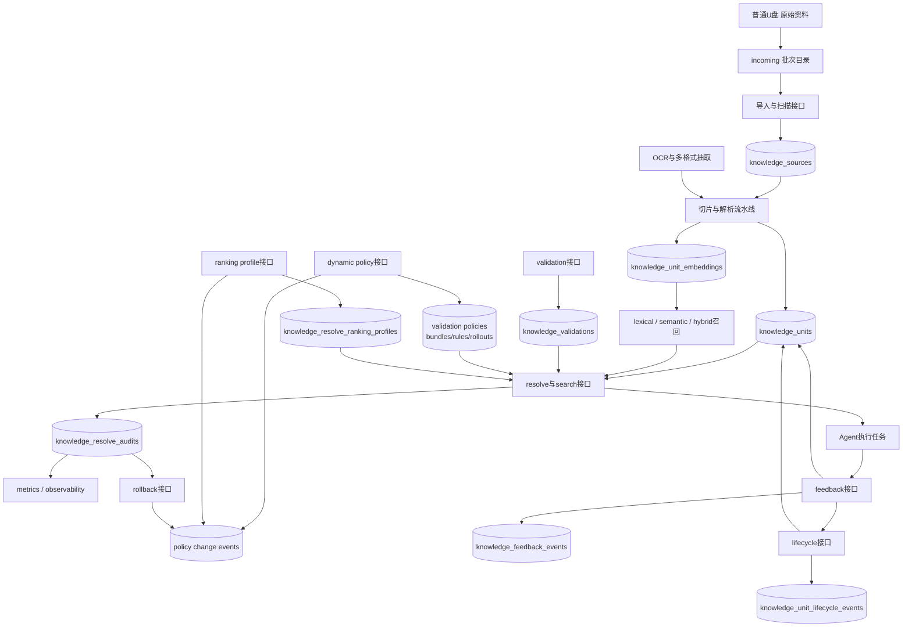
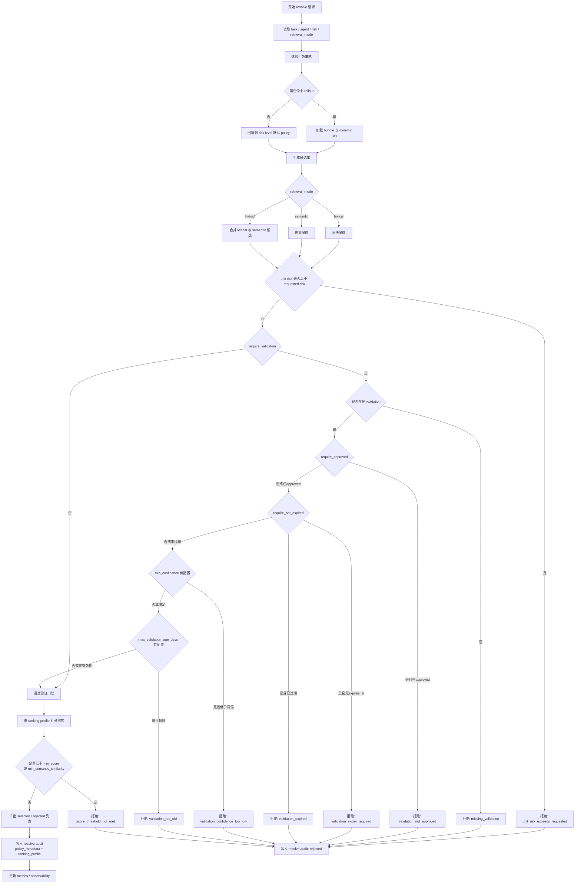

# OpenClaw 知识系统落地手册（简中）

本文面向 `8-Agent Panopticon + Mission Control` 主路线，给出“普通 U 盘仅存原始资料”的知识系统落地方案。

目标不是再搭一个“文档搜索”，而是把知识拆成可治理的资产：

- 原始资料可追溯
- 导入过程可审计
- 元数据可查询
- 后续可继续做切片/向量化/验证

---

## 1. 架构定位（当前实现）

当前仓库已完成以下最小闭环：

1. **原始资料层（USB）**
   - 挂载目录：`${PANOPTICON_USB_HOST_PATH}/${PANOPTICON_KNOWLEDGE_USB_SUBDIR}`
   - 容器内目录：`/data/knowledge-sources`
2. **知识登记层（Mission Control API）**
   - `POST /v1/knowledge/sources/import`
   - `POST /v1/knowledge/sources/scan`
   - `GET /v1/knowledge/sources`
   - `GET /v1/knowledge/sources/{id}`
3. **元数据存储层（Postgres）**
   - 表：`knowledge_sources`
  - 迁移：`20260331_0004`

说明：本阶段是“原始资料治理”，不是最终 RAG 检索系统。

## 1.1 知识系统实现图（Mermaid）



---

## 2. 目录规范（普通 U 盘）

推荐目录：

```text
knowledge-sources/
  incoming/
  processed/
  archive/
  tmp/
```

职责建议：

- `incoming/`：待导入文件
- `processed/`：已导入且仍在使用
- `archive/`：归档文件
- `tmp/`：OCR/转换临时文件

初始化脚本：

```bash
bash panopticon/tools/init_usb_knowledge_sources.sh
```

---

## 3. 环境变量与挂载

关键变量（`panopticon/.env`）：

```dotenv
PANOPTICON_USB_HOST_PATH=/media/pi/4A21-0000
PANOPTICON_USB_CONTAINER_PATH=/mnt/usb
PANOPTICON_KNOWLEDGE_USB_SUBDIR=knowledge-sources
```

Mission Control API 容器内知识根目录：

```dotenv
MC_KNOWLEDGE_RAW_SOURCES_DIR=/data/knowledge-sources
```

编排由生成器维护，不建议手改 `docker-compose.panopticon.yml`。

---

## 4. 数据模型（当前）

`knowledge_sources` 关键字段：

- `id`：UUID
- `source_type`：来源类型（默认 `file`）
- `title`：标题（默认文件名）
- `external_uri`：可选来源地址
- `storage_path`：相对知识根目录路径（唯一）
- `checksum_sha256`：内容哈希
- `mime_type`：MIME（可为空）
- `owner`：导入责任人（可为空）
- `version_label`：批次/标签（可为空）
- `status`：状态（默认 `active`）
- `meta`：扩展字段（JSON）
- `collected_at` / `updated_at`：时间戳

去重依据：`storage_path` 唯一约束。

---

## 5. API 使用手册

## 5.1 扫描目录（批量）

```bash
curl -X POST http://127.0.0.1:18910/v1/knowledge/sources/scan \
  -H 'Content-Type: application/json' \
  -d '{
    "subdir":"incoming/my-batch",
    "max_files":200,
    "dry_run":false,
    "owner":"batch-import",
    "version_label":"my-batch"
  }'
```

常用参数：

- `subdir`：相对 `MC_KNOWLEDGE_RAW_SOURCES_DIR` 的子目录
- `max_files`：最多扫描文件数
- `dry_run`：仅模拟，不写入
- `include_extensions`：可选后缀白名单（如 `md`,`pdf`）
- `owner`：导入责任标记
- `version_label`：批次标签

## 5.2 导入单文件

```bash
curl -X POST http://127.0.0.1:18910/v1/knowledge/sources/import \
  -H 'Content-Type: application/json' \
  -d '{
    "source_type":"file",
    "title":"示例文档",
    "relative_path":"incoming/my-batch/example.md",
    "owner":"manual-import",
    "version_label":"my-batch"
  }'
```

## 5.3 列表查询

```bash
curl 'http://127.0.0.1:18910/v1/knowledge/sources?limit=50'
```

按状态/类型查询：

```bash
curl 'http://127.0.0.1:18910/v1/knowledge/sources?source_type=file&status=active&limit=50'
```

---

## 6. 分批导入建议（按目录打标签）

推荐每次导入都建立批次目录：

```text
incoming/
  batch-20260330-root/
  batch-20260330-panopticon/
  batch-20260330-external/
```

并在扫描时配套 `version_label`：

- `batch-root`
- `batch-panopticon`
- `batch-external`

这样可以做到：

- 批次可追踪
- 回滚可定位
- 问题可按批次排查

---

## 7. 运维与排错

## 7.1 先看健康

```bash
curl http://127.0.0.1:18910/health
```

## 7.2 404（找不到 knowledge 接口）

常见原因：`mission-control-api` 还是旧镜像。

处理：

```bash
docker compose -f panopticon/docker-compose.panopticon.yml build mission-control-api
docker compose -f panopticon/docker-compose.panopticon.yml up -d mission-control-api
```

## 7.3 挂载失败（USB 路径权限/不存在）

先确保目录存在：

```bash
mkdir -p /media/pi/4A21-0000/knowledge-sources/{incoming,processed,archive,tmp}
```

再重启相关服务。

## 7.4 迁移确认

```bash
docker compose -f panopticon/docker-compose.panopticon.yml run --rm mission-control-api alembic current
```

期望包含：`20260404_0009 (head)`。

## 7.5 一键最小链路验收

仓库已提供可复用脚本：

```bash
bash tools/verify_knowledge_minimal_flow.sh
```

脚本会按顺序执行并校验：

1. 创建 `knowledge_units`
2. 写入 `knowledge_validations`
3. 调用 `resolve` 并确认命中刚创建的单元
4. 写入 `feedback` 并查询 `feedback summary`

策略与审计专项验收脚本：

```bash
bash tools/verify_knowledge_policy_audit_flow.sh
```

该脚本会验证：

1. `source -> units` 自动切片
2. 高风险 `resolve` 在验证前被拦截
3. 写入 validation 后可命中
4. 审计日志包含命中来源与拒绝原因

并额外执行 strict_mode 自动验收：
- 临时开启 `high` 风险策略的 `strict_mode=true`
- 构造“validation 缺关键字段”样例并断言 `resolve` 返回 `missing_validation_*` 拒绝原因（脚本结束后自动恢复原策略）

OCR 专项验收脚本：

```bash
bash tools/verify_knowledge_ocr_flow.sh
```

该脚本会验证图片 OCR 与扫描 PDF OCR fallback 是否都能成功切片。

OCR 运行参数（`POST /v1/knowledge/sources/{source_id}/chunk`）：

- `ocr_enabled`：是否启用当前请求的 OCR
- `ocr_languages`：传递给 Tesseract 的语言参数，例如 `eng`、`eng+chi_sim`
- `max_pdf_pages`：扫描 PDF OCR 的最大处理页数，超出部分会记录页数截断信息

可选参数：

- `BASE_URL`（默认 `http://127.0.0.1:18910`）
- `MC_API_TOKEN`（若启用了 Bearer 鉴权）

---

## 8. 安全与边界

- 普通 U 盘只放**原始资料**，不放 Postgres 主库与热索引。
- `knowledge_sources` 是登记层，不自动代表“已验证可执行知识”。
- 对高风险任务，后续应补：验证状态、有效期、冲突策略。

---

## 9. 已落地能力（本次新增）

本次已完成以下四项：

1. `knowledge_units`：切片后的可执行知识单元
2. `knowledge_validations`：验证人、验证状态、过期时间
3. `resolve` API：按任务/agent/risk 输出知识包
4. 反馈回流：记录 `usage/conflict/invalidation/promotion`

新增接口：

- `POST /v1/knowledge/units`
- `GET /v1/knowledge/units`
- `POST /v1/knowledge/sources/{source_id}/chunk`
- `POST /v1/knowledge/validations`
- `GET /v1/knowledge/validations`
- `GET /v1/knowledge/validation-policy`
- `PUT /v1/knowledge/validation-policy/{risk_level}`
- `POST /v1/knowledge/resolve`
- `GET /v1/knowledge/resolve/audits`
- `GET /v1/knowledge/resolve/rejections/summary`
- `GET /v1/knowledge/resolve/metrics`
  - 已聚合：`requests_without_hits`、`requests_without_rejections`、`resolve_rejection_rate`、`unit_selection_rate`、`expired_rejection_rate`
  - 已聚合：`risk_breakdown[]`（按 requested risk level 观察命中/拒绝分布）
- `POST /v1/knowledge/feedback`
- `GET /v1/knowledge/feedback/summary`

`resolve` 默认规则：

- 只返回 `active` 的知识单元。
- 支持按 `agent_scope`、`tags`、`risk_level` 过滤。
- 按风险级别套用 validation policy（可配置）：
  - `low`：默认不强制校验
  - `normal`：默认要求 `approved`
  - `high`：默认要求 `approved + 未过期 + confidence>=0.7 + 30天内验证`
  - `critical`：默认要求 `approved + 未过期 + confidence>=0.85 + 14天内验证`

### 9.1 按风险级别的 validation policy 决策图（Mermaid）



`resolve` 审计日志：

- 每次 `resolve` 都写入审计记录（`knowledge_resolve_audits`）
- 日志包含：命中的 `source_id/unit_key`、拒绝原因（如 `missing_validation`）与生效 policy 快照

反馈回流默认策略：

- `invalidation`：自动将知识单元状态置为 `inactive`
- `promotion`：自动确保知识单元状态为 `active`

本次继续补齐（已完成）：

- 自动切片流水线（`source -> units`）
- validation policy（不同风险级别的必检规则）
- resolve 审计日志（命中来源、拒绝原因）
- dynamic validation policy（bundle / rule / rollout）
- hybrid resolve 第二阶段第一版（排序、阈值、基准脚本）
- lifecycle management 第一版（显式 action + 事件流）
- policy version / rollout 第一版（bundle + rollout 命中）

---

## 10. 技术评估与后续顺序

本节按当前代码实现重新整理 backlog，避免继续把“已完成最小版接入”的能力误记为“尚未开始”。

### 10.1 当前评估结论

截至 `2026-04-04`，知识系统的工程状态可分为三层：

1. **已稳定落地**
   - `source -> units -> validation -> resolve -> audit -> feedback` 主链路已经打通，并有 P0 回归脚本持续验证。
   - 多格式解析与 OCR 第一版已落地。
   - metrics 已能观测 `resolve` 命中率、拒绝率、过期拒绝率与 OCR 聚合指标。

2. **已完成最小版接入，但仍需第二阶段优化**
   - 语义检索基础设施已经具备：`knowledge_unit_embeddings`、按模型/维度分区、最小 `POST /v1/knowledge/search`、最小 `semantic/hybrid resolve`、partial HNSW 模板均已落地。
   - 因此，后续不应再把该项表述为“是否接入语义召回或混合检索”，而应表述为“hybrid resolve 第二阶段优化”，重点转向排序、阈值、策略控制和性能基准。

3. **已进入第二阶段治理优化**
  - validation policy 已扩展到 `bundle / rule / rollout` 三层动态策略，但发布治理仍需继续增强报表、回滚与离线评估。
  - 生命周期管理第一版已具备显式 action 与事件流，后续仍可再收紧状态机约束与自动化晋升规则。
  - 策略版本与灰度切换已建模，但当前 rollback 仍是 soft rollback，观测报表也以审计聚合为主，尚未形成更重的发布控制台。

### 10.2 当前完成度（按阶段重写）

以下为当前阶段的真实完成状态，用于替代旧的“是否已接入”式待办写法。

### P0（稳定性，持续执行）

- [x] 保持 `source -> units -> validation -> resolve -> audit -> feedback` 链路稳定（已建立自动验收基线，持续执行）
- [x] 固化迁移与验收脚本，确保可重复回归（`tools/verify_knowledge_p0_regression.sh`）
- [x] 持续监控 `resolve` 审计与错误率（`GET /v1/knowledge/resolve/metrics`）

### P1（治理能力增强）

- [x] 接入 PDF、OCR、Office 等多格式解析（第一版已落地）
  - 已支持：`PDF + DOCX + PPTX + XLSX` 文本抽取并接入 `chunk`
  - OCR 第一版已支持：图片 OCR（`png/jpg/jpeg/webp`）与扫描 PDF OCR fallback（Tesseract）
- [x] 增加 resolve 审计聚合统计，输出命中率、拒绝原因分布、过期率
  - `GET /v1/knowledge/resolve/metrics` 已支持请求级命中/拒绝率、过期拒绝率、Top 拒绝原因占比
  - 已支持 `risk_breakdown[]`，用于按 requested risk level 观察命中/拒绝聚合
- [x] 将 validation policy 从按风险级别扩展到按 `task / agent / source_type` 的动态策略（第一版已落地）
  - 已新增：policy `bundle / rule / rollout` 三层结构
  - 当前行为：`resolve` 会先选 bundle，再命中 rollout，再尝试动态 rule，未命中时回退到原有 risk-level default policy
  - 审计已记录：`policy_source / bundle_key / rollout_key / rule_key`
  - 同优先级 rollout / rule 已补确定性 tie-breaker：默认按最近更新时间优先，避免旧配置抢占新发布
  - `task_pattern` 当前采用 `*` 通配符匹配语义，而不是正则表达式

### P2（智能化第二阶段）

- [x] 完成最小语义检索 / 混合检索接入
  - 已完成基础设施第 1 步：新增 `knowledge_unit_embeddings` 专用表，避免与通用 `memory_chunks` 混用
  - 已完成基础设施第 2 步：`chunk` 在启用 embedding 时可同步写入 `knowledge_unit_embeddings`
  - 已完成基础设施第 3 步：`knowledge_unit_embeddings` 已支持按模型维度存储，`MC_KNOWLEDGE_EMBEDDING_DIMENSIONS` 改为可选校验项，不再把知识向量链路锁死在 `1536`
  - 已完成基础设施第 4 步：新增最小 `POST /v1/knowledge/search`，查询时先按 `embedding_model + embedding_dimensions` 锁定向量分区，再执行 cosine 检索
  - 已完成基础设施第 5 步：`POST /v1/knowledge/resolve` 已支持最小 `hybrid` / `semantic` 检索模式，semantic 候选会并入原有 resolve 治理链路
  - 已补第一版索引策略：通用 `(embedding_model, embedding_dimensions, updated_at)` 过滤索引 + `bge-m3:latest / 1024` 的 partial HNSW
  - 已补常用模型索引模板：`mxbai-embed-large:latest / 1024`、`nomic-embed-text:latest / 768`、`all-minilm:latest / 384`
- [x] 推进 hybrid resolve 第二阶段优化（第一版已落地）
  - 已新增：`ranking_profile`、`min_semantic_similarity`、`min_score`
  - 已新增：`score_breakdown`，用于输出排序拆项与可解释性
  - 已新增：`tools/benchmark_knowledge_hybrid_resolve.sh`，用于输出 `p50 / p95 / mean` 延迟指标
- [x] 将 ranking profile 从硬编码档位推进为可配置对象
  - 已新增独立 ranking profile 数据模型与管理接口
  - `resolve` 审计会记录 `ranking_profile` 与 `ranking_profile_weights`
- [ ] 继续优化 hybrid resolve 第二阶段
  - 后续重点：更细的 source_type 权重、离线标注集、系统基准与自动调参

### P3（生命周期与发布控制）

- [x] 建立知识生命周期管理（第一版）
  - 已新增：`POST /v1/knowledge/units/{unit_id}/lifecycle`
  - 已新增：`GET /v1/knowledge/units/{unit_id}/lifecycle-events`
  - 已支撑：`promote / demote / invalidate / reactivate / archive / supersede`
  - 已接入：feedback 的 `promotion / invalidation` 会同步更新 lifecycle stage 并写入 event
- [x] 增加策略版本与灰度切换能力（第一版）
  - 已新增：policy bundle 作为版本实体，rollout 作为选择器/灰度入口
  - 已支撑：`full` 与 `percentage` 两种 rollout_mode
- [x] 补齐发布治理层的最小观测与回滚能力
  - 已新增：`change events`，覆盖 bundle / rule / rollout / ranking profile 的 create/update
  - 已新增：`observability summary`，按 resolve audit 聚合 bundle / rollout / ranking profile 的命中情况
  - 已新增：bundle / rollout `soft rollback`，按最近 change event 快照恢复；无前态时最小化为安全禁用
  - 已新增专用验收：`tools/verify_knowledge_policy_governance_flow.sh`

### 10.3 本轮按顺序完成的事项

本轮已按以下顺序完成：

1. **dynamic validation policy**
  - 已完成 bundle / rule / rollout 数据模型与管理接口
  - 已完成 resolve 中的动态匹配与 fallback

2. **hybrid resolve 第二阶段第一版**
  - 已完成排序拆项、阈值控制与基准脚本
  - 明确不再重复做“是否接入语义召回”的旧问题

3. **知识生命周期管理第一版**
  - 已完成显式 lifecycle action 与事件流
  - 已把 promotion / invalidation feedback 接入 lifecycle 管理

4. **策略版本与灰度切换第一版**
  - 已完成 bundle 作为版本实体、rollout 作为命中机制的最小闭环
  - 已在 resolve 审计中记录命中的策略来源与标识

5. **发布治理层补齐**
  - 已完成 ranking profile 配置化，不再局限于 `balanced / precision` 两档
  - 已完成变更事件、观察报表与 bundle / rollout 回滚工具

### 10.4 不建议当前阶段优先做的事

- 不建议把“继续补 embedding 基础设施”作为第一优先级。
  - 原因：向量写入、search、hybrid resolve、partial index 模板已经具备最小可用闭环。
- 不建议现在就做重型灰度发布框架。
  - 原因：当前已具备 rollout、观测摘要与 soft rollback，下一步应先补离线评估和更细的排序基准，而不是盲目继续堆更重的发布框架。
