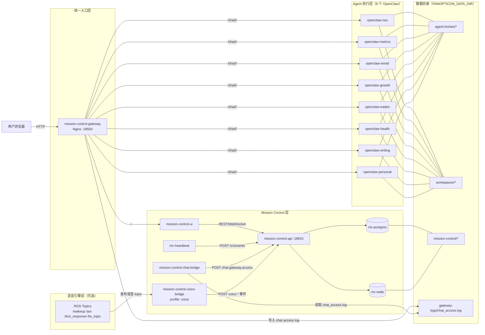

# 8-Agent Personal Panopticon（Docker Compose）

这是一份 **8-agent + Mission Control** 的 Docker Compose 模板，用于启动 8 个隔离的 OpenClaw agent（nox/metrics/email/growth/trades/health/writing/personal），并对齐 CN-IM 镜像的 **env → openclaw.json** 生成方式。

入口文件：

- Compose： [panopticon/docker-compose.panopticon.yml](panopticon/docker-compose.panopticon.yml)
- 每 agent env_file： [panopticon/env/](panopticon/env/)
- Agent 清单（单一来源）： [panopticon/agents.manifest.yaml](panopticon/agents.manifest.yaml)
- 生成工具： [panopticon/tools/generate_panopticon.py](panopticon/tools/generate_panopticon.py)
- 校验工具： [panopticon/tools/validate_panopticon.py](panopticon/tools/validate_panopticon.py)
- Skills 模板校验： [panopticon/tools/validate_skills_template.py](panopticon/tools/validate_skills_template.py)

另外新增：

- Mission Control env_file： [panopticon/env/mission-control.env.example](panopticon/env/mission-control.env.example)
- Mission Control UI env_file： [panopticon/env/mission-control-ui.env.example](panopticon/env/mission-control-ui.env.example)

## 项目整体框架（架构图 + 说明）



### 分层说明

- 统一入口层（Gateway）：`mission-control-gateway` 对外暴露 `18920`，负责同源入口与 `/chat/<agent>/` 反向代理，保障 Web Chat / WebSocket 稳定。
- Mission Control 层：`mission-control-ui` 提供控制台页面，`mission-control-api` 提供看板/任务/事件接口，`mc-heartbeat` 定时上报心跳事件，`mission-control-chat-bridge`/`mission-control-voice-bridge` 负责把外部观测信号汇聚为统一事件流。
- 语音引擎层（可选）：语音服务通过 ROS topics 输出状态与文本；`mission-control-voice-bridge` 订阅并标准化为 `voice.*` 事件写入 Mission Control。
- Agent 执行层：8 个 `openclaw-*` 容器彼此隔离，每个 agent 拥有独立 home 与 workspace。
- 数据持久层：统一落盘到 `PANOPTICON_DATA_DIR` 下（Postgres/Redis 数据、agent homes、workspaces、gateway logs）。

### 核心链路（从请求到可观测）

Chat 链路：

1. 用户从 `http://127.0.0.1:18920/chat/<agent>/` 访问 Chat。
1. Gateway 将请求直连到目标 `openclaw-<agent>`（减少中间层干扰，优先保证会话稳定）。
1. Gateway 同时把 chat 请求写入 `chat_access.log`（JSON）。
1. `mission-control-chat-bridge` 持续消费日志并上报 `chat.gateway.access` 到 `/v1/events`。

Voice 链路（可选，启用 `voice` profile）：

1. 语音引擎通过 ROS topics 发布唤醒/识别/回复/播报事件。
1. `mission-control-voice-bridge` 订阅 topics 并映射为 `voice.listening` / `voice.thinking` / `voice.speaking` 等标准事件。
1. bridge 将标准化事件 POST 到 `mission-control-api /v1/events`。
1. 事件进入 Mission Control feed 与 overlay，可用于实时状态展示、审计与稳定性观察。

### 配置/生成关系（避免手改回滚）

- 单一来源是 [panopticon/agents.manifest.yaml](panopticon/agents.manifest.yaml)。
- 通过 [panopticon/tools/generate_panopticon.py](panopticon/tools/generate_panopticon.py) 生成 compose 与 env 模板；变更应优先改 manifest/生成器，再执行生成。
- 生成后建议执行：`validate_panopticon.py` + `validate_skills_template.py` + `docker compose config` 三步校验。

## 快速启动

推荐流程（Manifest 驱动）：

1. 安装工具依赖：

```bash
pip install -r panopticon/tools/requirements.txt
```

1. 编辑 [panopticon/agents.manifest.yaml](panopticon/agents.manifest.yaml)

1. 生成 compose 与 env：

```bash
python panopticon/tools/generate_panopticon.py --prune
```

1. 校验配置：

```bash
python panopticon/tools/validate_panopticon.py
python panopticon/tools/validate_skills_template.py
```

可选：指定数据根目录（方便把数据放到 U 盘 / 外接 SSD / 树莓派挂载点）。

- 复制模板： [panopticon/.env.example](panopticon/.env.example) → `panopticon/.env`
- 修改 `PANOPTICON_DATA_DIR`：
  - Linux / Raspberry Pi：`/mnt/usb/panopticon-data`
  - Windows（Docker Desktop）：`E:/panopticon-data`

首次搬移到 U 盘/新磁盘后，建议先创建数据目录（等价于 `mkdir -p`）：

Linux / Raspberry Pi（bash）：

```bash
export PANOPTICON_DATA_DIR=/mnt/usb/panopticon-data

mkdir -p \
  "$PANOPTICON_DATA_DIR/mission-control/postgres-data" \
  "$PANOPTICON_DATA_DIR/mission-control/redis-data" \
  "$PANOPTICON_DATA_DIR/agent-homes/nox" \
  "$PANOPTICON_DATA_DIR/agent-homes/metrics" \
  "$PANOPTICON_DATA_DIR/agent-homes/email" \
  "$PANOPTICON_DATA_DIR/agent-homes/growth" \
  "$PANOPTICON_DATA_DIR/agent-homes/trades" \
  "$PANOPTICON_DATA_DIR/agent-homes/health" \
  "$PANOPTICON_DATA_DIR/agent-homes/writing" \
  "$PANOPTICON_DATA_DIR/agent-homes/personal" \
  "$PANOPTICON_DATA_DIR/workspaces/nox" \
  "$PANOPTICON_DATA_DIR/workspaces/metrics" \
  "$PANOPTICON_DATA_DIR/workspaces/email" \
  "$PANOPTICON_DATA_DIR/workspaces/growth" \
  "$PANOPTICON_DATA_DIR/workspaces/trades" \
  "$PANOPTICON_DATA_DIR/workspaces/health" \
  "$PANOPTICON_DATA_DIR/workspaces/writing" \
  "$PANOPTICON_DATA_DIR/workspaces/personal"
```

Windows（PowerShell）：

```powershell
$env:PANOPTICON_DATA_DIR = 'E:/panopticon-data'

$dirs = @(
  'mission-control/postgres-data',
  'mission-control/redis-data',
  'agent-homes/nox','agent-homes/metrics','agent-homes/email','agent-homes/growth',
  'agent-homes/trades','agent-homes/health','agent-homes/writing','agent-homes/personal',
  'workspaces/nox','workspaces/metrics','workspaces/email','workspaces/growth',
  'workspaces/trades','workspaces/health','workspaces/writing','workspaces/personal'
)

$dirs | ForEach-Object {
  $path = Join-Path $env:PANOPTICON_DATA_DIR $_
  New-Item -ItemType Directory -Force -Path $path | Out-Null
}
```

1. 编辑 8 份 env 模板（至少填 MODEL_ID / BASE_URL / API_KEY / OPENCLAW_GATEWAY_TOKEN）：

- [panopticon/env/nox.env.example](panopticon/env/nox.env.example)
- [panopticon/env/metrics.env.example](panopticon/env/metrics.env.example)
- [panopticon/env/email.env.example](panopticon/env/email.env.example)
- [panopticon/env/growth.env.example](panopticon/env/growth.env.example)
- [panopticon/env/trades.env.example](panopticon/env/trades.env.example)
- [panopticon/env/health.env.example](panopticon/env/health.env.example)
- [panopticon/env/writing.env.example](panopticon/env/writing.env.example)
- [panopticon/env/personal.env.example](panopticon/env/personal.env.example)

可选：如果要启用“语音引擎内置桥接（ROS topic -> Mission Control events）”，再编辑：

- [panopticon/env/mission-control-voice-bridge.env.example](panopticon/env/mission-control-voice-bridge.env.example)

1. 启动：

```bash
docker compose -f panopticon/docker-compose.panopticon.yml up -d
```

可选：启用语音桥接 profile（默认不启动）：

```bash
docker compose -f panopticon/docker-compose.panopticon.yml --profile voice up -d mission-control-voice-bridge
```

可选：语音桥接一键 E2E 验证（发布 ROS 测试 topic 并检查 `voice.*` 事件入库）：

```bash
bash panopticon/tools/test_voice_bridge_e2e.sh
```

1. 查看日志：

```bash
docker compose -f panopticon/docker-compose.panopticon.yml logs -f --tail=200
```

## 开机自启（Mission Control 一条命令）

启用（创建并启动 systemd 服务）：

```bash
bash panopticon/tools/setup_mission_control_autostart.sh
```

启用并包含语音桥接 profile（开机自动拉起 `mission-control-voice-bridge`）：

```bash
bash panopticon/tools/setup_mission_control_autostart.sh --with-voice
```

停用（移除 systemd 服务）：

```bash
bash panopticon/tools/setup_mission_control_autostart.sh --disable
```

该服务统一管理 `mc-redis`、`mc-postgres`、`mission-control-api`、`mission-control-ui`、`mc-heartbeat` 以及 8 个 `openclaw-*` agent 容器。

一键巡检 13 个服务（红绿结果）：

```bash
bash panopticon/tools/check_panopticon_services.sh
```

说明：该巡检已集成 voice-bridge E2E（统一入口）。

- 默认 `CHECK_VOICE_E2E=auto`：仅当 `mission-control-voice-bridge` 运行时才执行 E2E。
- `CHECK_VOICE_E2E=1`：强制执行 voice E2E（容器未运行将直接失败）。
- `CHECK_VOICE_E2E=0`：跳过 voice E2E，仅检查服务运行状态。

示例：

```bash
CHECK_VOICE_E2E=1 bash panopticon/tools/check_panopticon_services.sh
```

一键巡检 8 个 Agent 端点（Gateway 按 HTTP、Bridge 按 TCP）：

```bash
bash panopticon/tools/check_agent_endpoints.sh
```

## Control UI（Web Chat）推荐入口与 1008 排障

在 Panopticon 模式下，推荐一律从 Mission Control Gateway 的同源入口打开每个 agent 的 Control UI（它会注入 Authorization + LocalStorage 配置）：

```text
http://127.0.0.1:18920/chat/<agent>/
```

不要直接访问 `188xx`（例如 `http://127.0.0.1:18801/`），否则容易出现 `disconnected (1008)` 的 `token missing` / `unauthorized`。

如果看到 `unauthorized: device token mismatch`，直接运行一键轮换脚本（会同步 env + openclaw.json 并重启服务）：

```bash
bash panopticon/tools/rotate_gateway_tokens.sh
```

如果看到 `pairing required`（OpenClaw 新版设备配对机制）：
- 本仓库通过同源网关 + 信任代理配置来让 webchat 自动完成 silent pairing。
- 若你改过 Nginx 模板或 openclaw.json，确保 `/chat/<agent>/` 的反代配置仍然生效，并重建 `mission-control-gateway`：

```bash
docker compose -f panopticon/docker-compose.panopticon.yml up -d --force-recreate mission-control-gateway
```

安全提示：若你的网关配置会让反代请求被识别为 `127.0.0.1` 以自动配对，请不要把 `18920` 暴露到公网/不可信网段。

配对状态速查（最短 checklist）：

```text
容器内路径：/home/node/.openclaw/devices/pending.json 与 /home/node/.openclaw/devices/paired.json
```

```bash
AGENT=nox
docker exec openclaw-$AGENT sh -lc 'jq -r "\"pending=\" + ((keys|length)|tostring)" /home/node/.openclaw/devices/pending.json 2>/dev/null; jq -r "\"paired=\" + ((keys|length)|tostring)" /home/node/.openclaw/devices/paired.json 2>/dev/null'
```

如果路径找不到（你改了 OPENCLAW_HOME/镜像用户），用 find 定位：

```bash
AGENT=nox
docker exec openclaw-$AGENT sh -lc 'find / -maxdepth 6 -type f \( -name pending.json -o -name paired.json \) 2>/dev/null'
```

可选参数（环境变量）：

- `HOST`（默认 `127.0.0.1`）
- `HTTP_TIMEOUT`（默认 `5` 秒）
- `TCP_TIMEOUT`（默认 `3` 秒）

示例：

```bash
HOST=localhost HTTP_TIMEOUT=8 TCP_TIMEOUT=5 bash panopticon/tools/check_agent_endpoints.sh
```

一键测试 8 个 workspace 固定状态目录（`inbox/outbox/artifacts/state/sources`）：

```bash
# 严格模式（只检查）
python panopticon/tools/test_workspace_contract.py \
  --output panopticon/reports/workspace_contract_report_before.json

# 自动补齐缺失目录并复测
python panopticon/tools/test_workspace_contract.py \
  --auto-create \
  --output panopticon/reports/workspace_contract_report_after.json
```

综合评估（8-agent 协作 + Mission Control UI 监控）：

```bash
python panopticon/tools/comprehensive_assessment.py \
  --api-base http://127.0.0.1:18910 \
  --ui-base http://127.0.0.1:18920 \
  --feed-limit 800 \
  --output panopticon/reports/assessment.json
```

说明：该命令现在会**同时**执行：
- 协作评分（API/UI/事件链路/探针时延等）
- workspace 状态测试（`inbox/outbox/artifacts/state/sources`）
- 任务状态全面测试（`INBOX / ASSIGNED / IN PROGRESS / REVIEW / DONE`）

Chat 事件桥接（网关日志方案）：
- 网关保持 `/chat/<agent>/` 直连（保障 WebSocket 稳定），并将 chat 请求写入 `chat_access.log`（JSON）。
- `mission-control-chat-bridge` 持续消费该日志并上报 `chat.gateway.access` 到 Mission Control API。
- 默认以 `tail` 模式启动（仅消费新日志），不会回灌旧请求。

可选：执行“歌词任务”协作演练（metrics -> growth -> writing）并写入评估事件：

```bash
python panopticon/tools/comprehensive_assessment.py \
  --run-lyric-case \
  --feed-limit 800 \
  --workspace-auto-create \
  --output panopticon/reports/assessment_lyric_case.json
```

说明：
- 该脚本默认只读采集（health / board / feed / 网关可达性），并计算综合得分。
- `--run-lyric-case` 会向 `/v1/tasks` 与 `/v1/events` 写入演练数据。
- `--feed-limit` 可提升历史事件覆盖（默认 500，建议 500~1000）。
- `--workspace-auto-create` 会在 workspace 状态测试阶段自动补齐缺失目录。
- `--skip-workspace-contract` 可仅执行协作评分，不执行 workspace 状态测试。
- `--skip-status-test` 可跳过任务状态全面测试。
- 如 API 启用了鉴权，可通过 `--auth-token` 或环境变量 `MC_AUTH_TOKEN` 提供 token。

### 一键轮换 Gateway Token + 重启全栈

该脚本会为 8 个 agent 生成新 token（不打印出来），写入本地 `panopticon/env/*.env` 覆盖文件（已被 `.gitignore` 忽略），同步更新 `panopticon/agent-homes/<agent>/openclaw.json`，并用 `docker compose --force-recreate` 重启相关服务：

```bash
bash panopticon/tools/rotate_gateway_tokens.sh
```

## 增删 Agent 快速作业

新增 agent（建议）：

1. 在 [panopticon/agents.manifest.yaml](panopticon/agents.manifest.yaml) 新增一项：

- `slug`（全小写）
- `gateway_host_port` / `bridge_host_port`（不可冲突）
- `gateway_token`
- `enabled: true`

1. 运行：

```bash
python panopticon/tools/generate_panopticon.py --prune
python panopticon/tools/validate_panopticon.py
python panopticon/tools/validate_skills_template.py
docker compose -f panopticon/docker-compose.panopticon.yml up -d --build
```

下线/删除 agent：

1. 将该 agent 设为 `enabled: false`（或从 manifest 删除）

1. 运行：

```bash
python panopticon/tools/generate_panopticon.py --prune
python panopticon/tools/validate_panopticon.py
python panopticon/tools/validate_skills_template.py
docker compose -f panopticon/docker-compose.panopticon.yml up -d --remove-orphans
```

1. 如需释放数据空间，手动删除 `${PANOPTICON_DATA_DIR:-.}/agent-homes/<slug>` 与 `${PANOPTICON_DATA_DIR:-.}/workspaces/<slug>`。

## 端口映射（host → container）

Mission Control：

- API：18910→9090（REST + WebSocket）
- UI：18920→9090（Dash）

- nox：18801→26216，18802→18790
- metrics：18811→26216，18812→18790
- email：18821→26216，18822→18790
- growth：18831→26216，18832→18790
- trades：18841→26216，18842→18790
- health：18851→26216，18852→18790
- writing：18861→26216，18862→18790
- personal：18871→26216，18872→18790

## Mission Control Chat（内嵌对话）

Mission Control UI 已支持 `Chat` 按钮（与 `Skills` 同级）。点击后会打开内嵌 Chat 弹窗，可在 8 个 agent 间切换：

- nox → `http://127.0.0.1:18801`
- metrics → `http://127.0.0.1:18811`
- email → `http://127.0.0.1:18821`
- growth → `http://127.0.0.1:18831`
- trades → `http://127.0.0.1:18841`
- health → `http://127.0.0.1:18851`
- writing → `http://127.0.0.1:18861`
- personal → `http://127.0.0.1:18871`

交互说明：

- `Maximize`：应用内最大化 Chat 窗口。
- `Chat Only`：隐藏左侧选择区，仅保留对话区。
- `Open External`：若 iframe 因浏览器策略（例如 X-Frame-Options/CSP）无法显示，可一键外部打开。
- iframe 内嵌默认走 Mission Control 同域代理路径：`/chat/<agent>/...`（由 UI 容器转发到对应 agent 网关），用于规避目标网关返回的 `X-Frame-Options` 限制。

安全说明：

- Mission Control 支持在代理层按 agent 注入 `Authorization`（服务端注入，不暴露前端）。
- 可通过 `MISSION_CONTROL_CHAT_AGENT_TOKEN_MAP` 配置 token 映射（示例：`nox=token1,email=token2,...`）。
- 可通过 `MISSION_CONTROL_CHAT_AUTH_SCHEME` 设置鉴权前缀（默认 `Bearer`）。
- 如需改 Chat 主机地址，可设置 `MISSION_CONTROL_CHAT_HOST`（默认 `127.0.0.1`）。

实现说明（推荐）：

- 为了支持 Control UI 的 WebSocket（并稳定内嵌），18920 端口由 `mission-control-gateway`（nginx）对外提供。
- 该网关会将 `/` 转发到 `mission-control-ui`，并将 `/chat/<agent>/...` 转发到对应 `openclaw-<agent>:26216`，同时按 agent 注入 `Authorization`。
- token 建议放在本地文件 `panopticon/env/mission-control-gateway.env` 与 `panopticon/env/mission-control-ui.env`（已在 `.gitignore` 忽略，避免提交密钥）。

Mission Control API（示例）：

```bash
# 健康检查
curl http://localhost:18910/health

# 读取看板
curl http://localhost:18910/v1/boards/default

# 产生日志事件（可选）
curl -X POST http://localhost:18910/v1/events \
  -H "Content-Type: application/json" \
  -d '{"type":"agent.heartbeat","agent":"nox","payload":{"ok":true}}'

# 自动心跳上报日志
docker compose -f panopticon/docker-compose.panopticon.yml logs -f --tail=50 mc-heartbeat
```

## 数据隔离

- 每个 agent 的 OpenClaw home：`${PANOPTICON_DATA_DIR:-.}/agent-homes/<agent>`
- 每个 agent 的 workspace：`${PANOPTICON_DATA_DIR:-.}/workspaces/<agent>`（挂载到容器内 `/home/node/.openclaw/workspace`）
- Mission Control 数据：`${PANOPTICON_DATA_DIR:-.}/mission-control/*`

## 注意事项

- 该 compose 默认从本 repo 直接 build CN-IM 镜像：`../external/OpenClaw-Docker-CN-IM`（tag 为 `openclaw-docker-cn-im:local`）；首次启动会花较久时间在安装依赖与插件。
- `OPENCLAW_GATEWAY_PORT` / `OPENCLAW_BRIDGE_PORT` 在 env 中保持 **26216/18790**（容器内端口固定）；host 端口在 compose 中已做区分。

Mission Control：

- 默认不启用鉴权；如需简单鉴权可在 [panopticon/env/mission-control.env.example](panopticon/env/mission-control.env.example) 设置 `MC_AUTH_TOKEN`，并在请求加上 `Authorization: Bearer <token>`。
