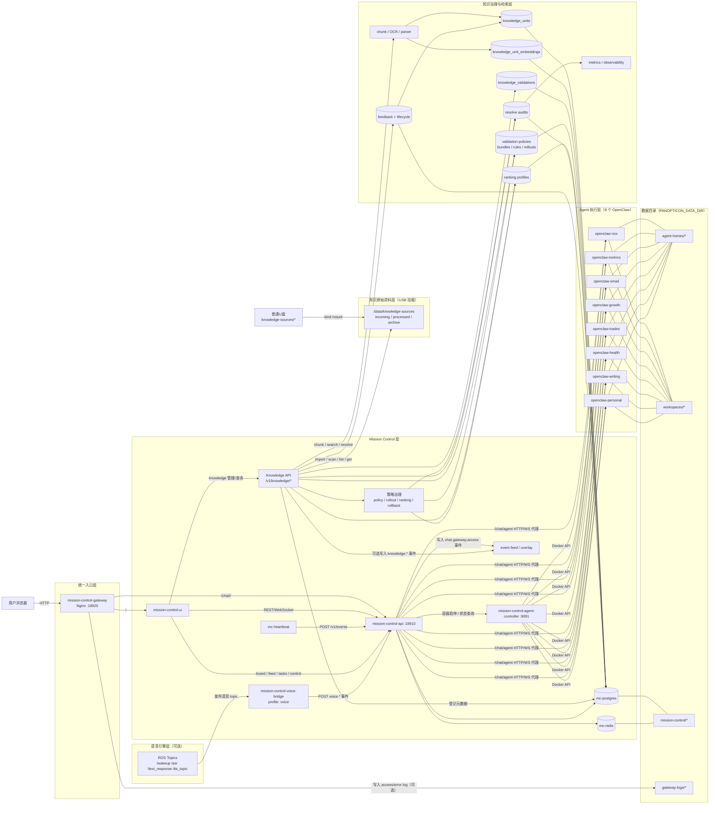

# 8-Agent Personal Panopticon（Docker Compose）

这是一份 **8-agent + Mission Control** 的 Docker Compose 模板，用于启动 8 个隔离的 OpenClaw agent（nox/metrics/email/growth/trades/health/writing/personal），并对齐 CN-IM 镜像的 **env → openclaw.json** 生成方式。

> **产品路径定位（2026-03）**
> - 本目录对应仓库的**当前主路线**（平台化运行路径）。
> - 根目录 `docker-compose.yml` 单容器路径仅为实验性方案，不作为主推或生产默认方案。

入口文件：

- Compose： [panopticon/docker-compose.panopticon.yml](panopticon/docker-compose.panopticon.yml)
- 每 agent env_file： [panopticon/env/](panopticon/env/)
- Agent 清单（单一来源）： [panopticon/agents.manifest.yaml](panopticon/agents.manifest.yaml)
- 生成工具： [panopticon/tools/generate_panopticon.py](panopticon/tools/generate_panopticon.py)
- 校验工具： [panopticon/tools/validate_panopticon.py](panopticon/tools/validate_panopticon.py)
- Skills 模板校验（覆盖 global-skills 与 workspace-local skills）： [panopticon/tools/validate_skills_template.py](panopticon/tools/validate_skills_template.py)
- Workspace 文档基线模板： [panopticon/templates/workspace-doc-baseline.md](panopticon/templates/workspace-doc-baseline.md)
- Workspace 可复制骨架包： [panopticon/templates/workspace-skeleton/README.md](panopticon/templates/workspace-skeleton/README.md)
- Workspace 一键脚手架： [panopticon/tools/scaffold_workspace_docs.py](panopticon/tools/scaffold_workspace_docs.py)

另外新增：

- Mission Control env_file： [panopticon/env/mission-control.env.example](panopticon/env/mission-control.env.example)
- Mission Control UI env_file： [panopticon/env/mission-control-ui.env.example](panopticon/env/mission-control-ui.env.example)

Mission Control 数据初始化策略：

- `mission-control-api` 启动时会先执行 Alembic 迁移（`alembic upgrade head`），再启动 API 服务。
- `mc-postgres` 不再依赖 `docker-entrypoint-initdb.d` 的 schema SQL 挂载。
- schema 变更应统一通过 `mission_control_api/alembic/versions/` 管理。

## 项目整体框架（架构图 + 说明）


```mermaid
flowchart LR
  U[用户浏览器]
  USB[普通U盘\nknowledge-sources/*]

  subgraph G[统一入口层]
    GW[mission-control-gateway\nNginx :18920]
  end

  subgraph MC[Mission Control 层]
    UI[mission-control-ui]
    API[mission-control-api :18910]
    AC[mission-control-agent-controller :9091]
    FEED[event feed / overlay]
    KQ[Knowledge API\n/v1/knowledge/*]
    GOV[策略治理\npolicy / rollout / ranking / rollback]
    HB[mc-heartbeat]
    VB[mission-control-voice-bridge\nprofile: voice]
    PG[(mc-postgres)]
    RD[(mc-redis)]
  end

  subgraph VOICE[语音引擎层（可选）]
    ROS[ROS Topics\n/wakeup /asr /text_response /tts_topic]
  end

  subgraph AG[Agent 执行层（8 个 OpenClaw）]
    A1[openclaw-nox]
    A2[openclaw-metrics]
    A3[openclaw-email]
    A4[openclaw-growth]
    A5[openclaw-trades]
    A6[openclaw-health]
    A7[openclaw-writing]
    A8[openclaw-personal]
  end

  subgraph DATA[数据目录（PANOPTICON_DATA_DIR）]
    AH[agent-homes/*]
    WS[workspaces/*]
    MD[mission-control/*]
    GL[gateway-logs/*]
  end

  subgraph KRAW[知识原始资料层（USB 挂载）]
    KS["/data/knowledge-sources<br/>incoming / processed / archive"]
  end

  subgraph KPROC[知识治理与检索层]
    CHUNK[chunk / OCR / parser]
    KU[(knowledge_units)]
    KEMB[(knowledge_unit_embeddings)]
    KVAL[(knowledge_validations)]
    KPOL[(validation policies\nbundles / rules / rollouts)]
    KRANK[(ranking profiles)]
    KAUD[(resolve audits)]
    KOBS[metrics / observability]
    KFB[(feedback + lifecycle)]
  end

  U -->|HTTP| GW
  GW -->|/| UI
  GW -->|/chat/<agent>/| API
  GW -->|写入 access/error log（可选）| GL

  UI -->|REST/WebSocket| API
  HB -->|POST /v1/events| API
  UI -->|knowledge 管理/查询| KQ
  UI -->|board / feed / tasks / control| API
  ROS -->|发布语音 topic| VB
  VB -->|POST voice.* 事件| API
  USB -->|bind mount| KS
  KQ -->|import / scan / list / get| KS
  KQ -->|chunk / search / resolve| CHUNK
  CHUNK --> KU
  CHUNK --> KEMB
  KQ --> KVAL
  KQ --> KPOL
  KQ --> KRANK
  KQ --> GOV
  GOV --> KPOL
  GOV --> KRANK
  GOV --> KAUD
  KQ --> KAUD
  KAUD --> KOBS
  KQ --> KFB
  KFB --> KU
  KQ -->|登记元数据| PG
  KU --> PG
  KEMB --> PG
  KVAL --> PG
  KPOL --> PG
  KRANK --> PG
  KAUD --> PG
  KFB --> PG
  API -->|容器启停 / 状态查询| AC
  API -->|/chat/agent HTTP/WS 代理| A1
  API -->|/chat/agent HTTP/WS 代理| A2
  API -->|/chat/agent HTTP/WS 代理| A3
  API -->|/chat/agent HTTP/WS 代理| A4
  API -->|/chat/agent HTTP/WS 代理| A5
  API -->|/chat/agent HTTP/WS 代理| A6
  API -->|/chat/agent HTTP/WS 代理| A7
  API -->|/chat/agent HTTP/WS 代理| A8
  API -->|写入 chat.gateway.access 事件| FEED
  KQ -->|可选写入 knowledge.* 事件| FEED
  AC -->|Docker API| A1
  AC -->|Docker API| A2
  AC -->|Docker API| A3
  AC -->|Docker API| A4
  AC -->|Docker API| A5
  AC -->|Docker API| A6
  AC -->|Docker API| A7
  AC -->|Docker API| A8

  API --> PG
  API --> RD

  A1 --- AH
  A2 --- AH
  A3 --- AH
  A4 --- AH
  A5 --- AH
  A6 --- AH
  A7 --- AH
  A8 --- AH
  A1 --- WS
  A2 --- WS
  A3 --- WS
  A4 --- WS
  A5 --- WS
  A6 --- WS
  A7 --- WS
  A8 --- WS
  PG --- MD
  RD --- MD
```

### 分层说明

- 统一入口层（Gateway）：`mission-control-gateway` 对外暴露 `18920`，统一承载同源入口，并将 `/` 转发给 `mission-control-ui`、`/chat/<agent>/...` 转发给 `mission-control-api`。
- Mission Control 层：`mission-control-ui` 提供控制台页面，`mission-control-api` 提供看板/任务/事件接口，同时承担 Chat 的 HTTP/WebSocket 统一代理；`mc-heartbeat` 定时上报心跳事件，`mission-control-voice-bridge` 负责语音事件汇聚；Knowledge API 现已扩展到 `/v1/knowledge/*`，覆盖 source、chunk、validation、search、resolve、feedback、lifecycle 与治理接口。
- 容器控制层：`mission-control-agent-controller` 通过 Docker socket / CLI 代表 `mission-control-api` 执行 agent 容器状态查询、启停与编排控制；该服务由 manifest 和生成器统一产出，不建议手改 compose。
- 知识治理与检索层：知识链路已经从“原始资料登记”扩展为 `source -> chunk/OCR -> units/embeddings -> validation/policy -> search/resolve -> audit/feedback/lifecycle` 的完整治理闭环，并新增 ranking profile、observability summary、bundle/rollout rollback 等发布治理能力。
- 语音引擎层（可选）：语音服务通过 ROS topics 输出状态与文本；`mission-control-voice-bridge` 订阅并标准化为 `voice.*` 事件写入 Mission Control。
- Agent 执行层：8 个 `openclaw-*` 容器彼此隔离，每个 agent 拥有独立 home 与 workspace。
- 数据持久层：统一落盘到 `PANOPTICON_DATA_DIR` 下（Postgres/Redis 数据、agent homes、workspaces、gateway logs）。
- 知识原始资料层（可选）：`mission-control-api` 默认读取 `./mission-control/knowledge-sources` 并挂载到容器内 `/data/knowledge-sources`；如需改到外接 U 盘 / SSD / Windows 盘符，请显式设置 `PANOPTICON_KNOWLEDGE_RAW_SOURCES_PATH`。

### 核心链路（从请求到可观测）

Chat 链路：

1. 用户从 `http://127.0.0.1:18920/chat/<agent>/` 访问 Chat。
1. Gateway 将请求同源转发到 `mission-control-api /chat/{agent}/...`。
1. `mission-control-api` 统一处理 Control UI 注入、鉴权补强与 HTTP/WebSocket 代理，再转发到目标 `openclaw-<agent>`。
1. `mission-control-api` 在代理入口直接写入 `chat.gateway.access` 事件（不再依赖日志桥接）。
1. 事件进入 Mission Control feed 与 overlay，用于实时观察与审计。

Voice 链路（可选，启用 `voice` profile）：

1. 语音引擎通过 ROS topics 发布唤醒/识别/回复/播报事件。
1. `mission-control-voice-bridge` 订阅 topics 并映射为 `voice.listening` / `voice.thinking` / `voice.speaking` 等标准事件。
1. bridge 将标准化事件 POST 到 `mission-control-api /v1/events`。
1. 事件进入 Mission Control feed 与 overlay，可用于实时状态展示、审计与稳定性观察。

Knowledge 原始资料链路（可选外接盘）：

1. 将外部资料放入 `${PANOPTICON_KNOWLEDGE_RAW_SOURCES_PATH:-./mission-control/knowledge-sources}/incoming`。
1. `mission-control-api` 通过 bind mount 读取容器内 `/data/knowledge-sources/incoming`。
1. 调用 `POST /v1/knowledge/sources/scan` 或 `POST /v1/knowledge/sources/import` 完成登记。
1. 调用 `POST /v1/knowledge/sources/{source_id}/chunk` 后，系统会执行多格式解析、OCR fallback，并生成 `knowledge_units`；启用 embedding 时会同步写入 `knowledge_unit_embeddings`。
1. `POST /v1/knowledge/resolve` 会按 dynamic policy、rollout、ranking profile 选择知识包，并将命中/拒绝原因写入 `knowledge_resolve_audits`。
1. `GET /v1/knowledge/resolve/metrics` 与 `GET /v1/knowledge/validation-policy/observability/summary` 可用于观察命中率、拒绝原因、bundle/rollout/ranking profile 使用情况；必要时可通过 rollback 接口回退策略发布。
1. 原始文件继续保留在 U 盘，结构化元数据、切片、向量、审计和治理状态统一写入 Postgres，用于后续审计、回溯与持续治理。

### 配置/生成关系（避免手改回滚）

- 单一来源是 [panopticon/agents.manifest.yaml](panopticon/agents.manifest.yaml)。
- 通过 [panopticon/tools/generate_panopticon.py](panopticon/tools/generate_panopticon.py) 生成 compose 与 env 模板；变更应优先改 manifest/生成器，再执行生成。
- 生成后建议执行：`validate_panopticon.py` + `validate_skills_template.py` + `docker compose config` 三步校验。
- `validate_skills_template.py` 默认会同时扫描 `global-skills` 与 `workspaces/*/skills/*/SKILL.md`，并按模板类型区分最小契约；其中 workspace `knowledge-eval` 还会校验 `scripts/run_eval_artifact.py` 与产物路径约定。

Mission Control 生成器字段（请在 manifest 维护，不要手改 compose）：

- `mission_control.agent_controller_enabled`：是否启用容器控制器服务生成。高风险能力，默认按“显式 opt-in”处理；字段缺省时生成器按 `false`。
- `mission_control.agent_controller_url`：`mission-control-api` 访问控制器的内部地址（默认 `http://mission-control-agent-controller:9091`）。

当 `agent_controller_enabled: true` 时，生成器会自动产出以下内容：

- 服务 `mission-control-agent-controller`（含 docker.sock 与 docker CLI 挂载）。
- `mission-control-api` 的 `MC_AGENT_CONTROLLER_URL` 环境变量。
- `mission-control-api` 对 `mission-control-agent-controller` 的 `depends_on`。
- `mission-control.env.example` 中的 `MC_AGENT_CONTROLLER_AUTH_TOKEN` 将成为启动前必填项；未配置真实 token 时，`validate_panopticon.py` 会直接失败。

启用前提：仅当你确实需要从 Mission Control 远程执行 agent 容器启停/重启时，才建议把 `agent_controller_enabled` 设为 `true`。如果不需要远程容器控制，建议保持关闭，减少 docker.sock 暴露面。

维护约束：若需要调整上述行为，请修改 [panopticon/agents.manifest.yaml](panopticon/agents.manifest.yaml) 或 [panopticon/tools/generate_panopticon.py](panopticon/tools/generate_panopticon.py) 后重新生成；不要直接长期维护 [panopticon/docker-compose.panopticon.yml](panopticon/docker-compose.panopticon.yml)。

## 快速启动

推荐流程（Manifest 驱动）：

1. 安装工具依赖：

```bash
pip install -r panopticon/tools/requirements.txt
```

1. 编辑 [panopticon/agents.manifest.yaml](panopticon/agents.manifest.yaml)

1. 当 `agent_runtime.gateway_auth_mode=token`（默认）时，必须先完成 Gateway token 轮换，再进入生成与校验：

```bash
bash panopticon/tools/rotate_gateway_tokens.sh
```

说明：`validate_panopticon.py` 会直接拒绝 `CHANGE_ME_*`、`TODO`、`REPLACE_ME`、`YOUR_TOKEN` 一类占位值；未轮换 token 前，主路线不应继续启动。

1. 如果要启用远程容器控制，再额外完成以下高风险配置：

- 在 [panopticon/agents.manifest.yaml](panopticon/agents.manifest.yaml) 显式保留或设置 `mission_control.agent_controller_enabled: true`
- 在 [panopticon/env/mission-control.env.example](panopticon/env/mission-control.env.example) 填写真实 `MC_AGENT_CONTROLLER_AUTH_TOKEN`
- 若不需要该能力，建议将 `mission_control.agent_controller_enabled` 设为 `false`

1. 生成 compose 与 env：

```bash
python panopticon/tools/generate_panopticon.py --prune
```

1. 校验配置：

```bash
python panopticon/tools/validate_panopticon.py
python panopticon/tools/validate_skills_template.py
```

其中第二条会同时检查全局 skills 与各 workspace 本地 skills；若 workspace skill 采用 `Trigger / Steps / Output / Review Gate` 契约，缺任一节会直接失败。

如已启用 `mission_control.agent_controller_enabled: true`，建议在重建相关服务后补跑一条鉴权回归检查：

```bash
bash panopticon/tools/test_agent_controller_auth.sh
```

该脚本会在真实容器网络内验证：

- 未带 token 调 controller 会被拒绝
- 错 token 会被拒绝
- 正确 token 才会进入 allowlist / action 参数校验

可选：指定数据根目录（方便把数据放到 U 盘 / 外接 SSD / 树莓派挂载点）。

- 复制模板： [panopticon/.env.example](panopticon/.env.example) → `panopticon/.env`
- 修改 `PANOPTICON_DATA_DIR`：
  - Linux / Raspberry Pi：`/mnt/usb/panopticon-data`
  - Windows（Docker Desktop）：`E:/panopticon-data`
- 如需让全部 `openclaw-*` agent 共享访问宿主目录（可为 U 盘、SSD 或本地目录），再额外设置：
  - Linux：`PANOPTICON_USB_HOST_PATH=/mnt/usb/openclaw-shared`
  - Raspberry Pi：`PANOPTICON_USB_HOST_PATH=/media/pi/OPENCLAW/openclaw-shared`
  - Windows（Docker Desktop）：`PANOPTICON_USB_HOST_PATH=E:/openclaw-shared`
  - `PANOPTICON_USB_CONTAINER_PATH=/mnt/usb`
  - 建议在 U 盘下使用 `agents/<slug>/` 作为每个 agent 的归档子目录；容器内对应路径为 `/mnt/usb/agents/<slug>`，并通过环境变量 `PANOPTICON_USB_AGENT_DIR` 暴露给 agent。
- 如需把知识原始资料放到外接盘，再额外设置：
  - Linux：`PANOPTICON_KNOWLEDGE_RAW_SOURCES_PATH=/mnt/usb/knowledge-sources`
  - Raspberry Pi：`PANOPTICON_KNOWLEDGE_RAW_SOURCES_PATH=/media/pi/OPENCLAW/knowledge-sources`
  - Windows（Docker Desktop）：`PANOPTICON_KNOWLEDGE_RAW_SOURCES_PATH=E:/knowledge-sources`
- 如果以上两个变量都不设置，最小启动会使用仓库内的中性默认目录：`./shared-usb` 和 `./mission-control/knowledge-sources`。

推荐策略（Git 与运行态分离）：

- `panopticon/workspaces/*` 在仓库里只保留可复用基线（文档、skills、必要源码）。
- `inbox/outbox/artifacts/state/sources/.openclaw` 与 `memory/YYYY-MM-DD.md` 等运行态数据放在 `PANOPTICON_DATA_DIR/workspaces/*`。
- 工具脚本默认按以下优先级找 workspace 根目录：`PANOPTICON_WORKSPACES_ROOT` > `PANOPTICON_DATA_DIR/workspaces` > `panopticon/workspaces`。

### 可选：把知识原始资料放到外接盘

最小启动不要求外接盘；如果你只是先跑通主路线，直接使用默认的 `./mission-control/knowledge-sources` 即可。

如果你要把原始资料迁到外接 U 盘 / SSD / Windows 盘符，建议只把原始资料放上去，不要把 Postgres 主库/热索引放在普通 U 盘。

1) 初始化 U 盘知识目录：

```bash
export PANOPTICON_KNOWLEDGE_RAW_SOURCES_PATH=/mnt/usb/knowledge-sources
bash panopticon/tools/init_usb_knowledge_sources.sh
```

2) 把资料放到：

```text
${PANOPTICON_KNOWLEDGE_RAW_SOURCES_PATH}/incoming
```

3) 启动后调用 Mission Control API 扫描入库：

```bash
curl -X POST http://127.0.0.1:18910/v1/knowledge/sources/scan \
  -H 'Content-Type: application/json' \
  -d '{"subdir":"incoming","max_files":200,"dry_run":false}'
```

4) 查看已登记知识源：

```bash
curl 'http://127.0.0.1:18910/v1/knowledge/sources?limit=50'
```

首次搬移到 U 盘/新磁盘后，建议先创建数据目录（等价于 `mkdir -p`）：

Linux / Raspberry Pi（bash）：

```bash
export PANOPTICON_DATA_DIR=/mnt/usb/panopticon-data

mkdir -p \
  "$PANOPTICON_DATA_DIR/mission-control/postgres-data" \
  "$PANOPTICON_DATA_DIR/mission-control/redis-data" \
  "$PANOPTICON_DATA_DIR/agent-homes/nox" \
  "$PANOPTICON_DATA_DIR/agent-homes/metrics" \
  "$PANOPTICON_DATA_DIR/agent-homes/email" \
  "$PANOPTICON_DATA_DIR/agent-homes/growth" \
  "$PANOPTICON_DATA_DIR/agent-homes/trades" \
  "$PANOPTICON_DATA_DIR/agent-homes/health" \
  "$PANOPTICON_DATA_DIR/agent-homes/writing" \
  "$PANOPTICON_DATA_DIR/agent-homes/personal" \
  "$PANOPTICON_DATA_DIR/workspaces/nox" \
  "$PANOPTICON_DATA_DIR/workspaces/metrics" \
  "$PANOPTICON_DATA_DIR/workspaces/email" \
  "$PANOPTICON_DATA_DIR/workspaces/growth" \
  "$PANOPTICON_DATA_DIR/workspaces/trades" \
  "$PANOPTICON_DATA_DIR/workspaces/health" \
  "$PANOPTICON_DATA_DIR/workspaces/writing" \
  "$PANOPTICON_DATA_DIR/workspaces/personal"
```

Windows（PowerShell）：

```powershell
$env:PANOPTICON_DATA_DIR = 'E:/panopticon-data'

$dirs = @(
  'mission-control/postgres-data',
  'mission-control/redis-data',
  'agent-homes/nox','agent-homes/metrics','agent-homes/email','agent-homes/growth',
  'agent-homes/trades','agent-homes/health','agent-homes/writing','agent-homes/personal',
  'workspaces/nox','workspaces/metrics','workspaces/email','workspaces/growth',
  'workspaces/trades','workspaces/health','workspaces/writing','workspaces/personal'
)

$dirs | ForEach-Object {
  $path = Join-Path $env:PANOPTICON_DATA_DIR $_
  New-Item -ItemType Directory -Force -Path $path | Out-Null
}
```

1. 编辑 8 份 env 模板（至少填 MODEL_ID / BASE_URL / API_KEY / OPENCLAW_GATEWAY_TOKEN）：

- [panopticon/env/nox.env.example](panopticon/env/nox.env.example)
- [panopticon/env/metrics.env.example](panopticon/env/metrics.env.example)
- [panopticon/env/email.env.example](panopticon/env/email.env.example)
- [panopticon/env/growth.env.example](panopticon/env/growth.env.example)
- [panopticon/env/trades.env.example](panopticon/env/trades.env.example)
- [panopticon/env/health.env.example](panopticon/env/health.env.example)
- [panopticon/env/writing.env.example](panopticon/env/writing.env.example)
- [panopticon/env/personal.env.example](panopticon/env/personal.env.example)

可选：如果要启用“语音引擎内置桥接（ROS topic -> Mission Control events）”，再编辑：

- [panopticon/env/mission-control-voice-bridge.env.example](panopticon/env/mission-control-voice-bridge.env.example)

可选：如果要启用 `mission-control-agent-controller`，还需要编辑：

- [panopticon/env/mission-control.env.example](panopticon/env/mission-control.env.example)

并填写：

- `MC_AGENT_CONTROLLER_AUTH_TOKEN=<随机长 token>`

1. 启动：

```bash
docker compose -f panopticon/docker-compose.panopticon.yml up -d
```

可选：启用语音桥接 profile（默认不启动）：

```bash
docker compose -f panopticon/docker-compose.panopticon.yml --profile voice up -d mission-control-voice-bridge
```

可选：语音桥接一键 E2E 验证（发布 ROS 测试 topic 并检查 `voice.*` 事件入库）：

```bash
bash panopticon/tools/test_voice_bridge_e2e.sh
```

1. 查看日志：

```bash
docker compose -f panopticon/docker-compose.panopticon.yml logs -f --tail=200
```

## 开机自启（Mission Control 一条命令）

启用（创建并启动 systemd 服务）：

```bash
bash panopticon/tools/setup_mission_control_autostart.sh
```

启用并包含语音桥接 profile（开机自动拉起 `mission-control-voice-bridge`）：

```bash
bash panopticon/tools/setup_mission_control_autostart.sh --with-voice
```

停用（移除 systemd 服务）：

```bash
bash panopticon/tools/setup_mission_control_autostart.sh --disable
```

该服务统一管理 `mc-redis`、`mc-postgres`、`mission-control-api`、`mission-control-ui`、`mc-heartbeat` 以及 8 个 `openclaw-*` agent 容器。

一键巡检 13 个服务（红绿结果）：

```bash
bash panopticon/tools/check_panopticon_services.sh
```

说明：该巡检已集成 voice-bridge E2E（统一入口）。

- 默认 `CHECK_VOICE_E2E=auto`：仅当 `mission-control-voice-bridge` 运行时才执行 E2E。
- `CHECK_VOICE_E2E=1`：强制执行 voice E2E（容器未运行将直接失败）。
- `CHECK_VOICE_E2E=0`：跳过 voice E2E，仅检查服务运行状态。

示例：

```bash
CHECK_VOICE_E2E=1 bash panopticon/tools/check_panopticon_services.sh
```

一键巡检 8 个 Agent 端点（Gateway 按 HTTP、Bridge 按 TCP）：

```bash
bash panopticon/tools/check_agent_endpoints.sh
```

## 运维重启顺序（避免 502）

当你重建或重启 `mission-control-ui` 后，建议按以下顺序操作：

优先直接执行一键恢复脚本：

```bash
bash panopticon/tools/recover_mission_control_gateway.sh
```

该脚本会自动完成：重建 `mission-control-api` / `mission-control-ui`、强制重建 `mission-control-gateway`，并校验 `18920` 首页与 `18910/health`。

如果你需要手工执行，再按以下顺序操作：

1. 重建/重启 API 与 UI：

```bash
docker compose -f panopticon/docker-compose.panopticon.yml up -d --build mission-control-api mission-control-ui
```

2. 强制重建 Gateway（关键步骤）：

```bash
docker compose -f panopticon/docker-compose.panopticon.yml up -d --force-recreate mission-control-gateway
```

3. 快速验收：

```bash
curl -I http://localhost:18920/
curl -fsS http://localhost:18910/health
```

说明：`mission-control-gateway` 若仍缓存旧 upstream 容器 IP，可能出现 `502 Bad Gateway`（常见于 `/_dash-update-component`）；`--force-recreate mission-control-gateway` 可让网关重新解析上游地址。

## Control UI（Web Chat）推荐入口与 1008 排障

在 Panopticon 模式下，推荐一律从 Mission Control Gateway 的同源入口打开每个 agent 的 Control UI（由 `mission-control-api` 代理层注入 Authorization + LocalStorage 配置）：

```text
http://127.0.0.1:18920/chat/<agent>/
```

不要直接访问 `188xx`（例如 `http://127.0.0.1:18801/`），否则容易出现 `disconnected (1008)` 的 `token missing` / `unauthorized`。

如果看到 `unauthorized: device token mismatch`，直接运行一键轮换脚本（会同步 env + openclaw.json 并重启服务）：

```bash
bash panopticon/tools/rotate_gateway_tokens.sh
```

如果看到 `pairing required`（OpenClaw 新版设备配对机制）：
- 本仓库通过同源网关（`18920`）+ API 统一代理 + 信任代理配置来让 webchat 自动完成 silent pairing。
- 若你改过 Nginx 模板或 openclaw.json，确保 `/chat/<agent>/` 的反代配置仍然生效，并重建 `mission-control-gateway`：

```bash
docker compose -f panopticon/docker-compose.panopticon.yml up -d --force-recreate mission-control-gateway
```

安全提示：若你的网关配置会让反代请求被识别为 `127.0.0.1` 以自动配对，请不要把 `18920` 暴露到公网/不可信网段。

配对状态速查（最短 checklist）：

```text
容器内路径：/home/node/.openclaw/devices/pending.json 与 /home/node/.openclaw/devices/paired.json
```

```bash
AGENT=nox
docker exec openclaw-$AGENT sh -lc 'jq -r "\"pending=\" + ((keys|length)|tostring)" /home/node/.openclaw/devices/pending.json 2>/dev/null; jq -r "\"paired=\" + ((keys|length)|tostring)" /home/node/.openclaw/devices/paired.json 2>/dev/null'
```

如果路径找不到（你改了 OPENCLAW_HOME/镜像用户），用 find 定位：

```bash
AGENT=nox
docker exec openclaw-$AGENT sh -lc 'find / -maxdepth 6 -type f \( -name pending.json -o -name paired.json \) 2>/dev/null'
```

可选参数（环境变量）：

- `HOST`（默认 `127.0.0.1`）
- `HTTP_TIMEOUT`（默认 `5` 秒）
- `TCP_TIMEOUT`（默认 `3` 秒）

示例：

```bash
HOST=localhost HTTP_TIMEOUT=8 TCP_TIMEOUT=5 bash panopticon/tools/check_agent_endpoints.sh
```

一键测试 8 个 workspace 固定状态目录（`inbox/outbox/artifacts/state/sources`）：

```bash
# 严格模式（只检查）
python panopticon/tools/test_workspace_contract.py \
  --output panopticon/reports/workspace_contract_report_before.json

# 自动补齐缺失目录并复测
python panopticon/tools/test_workspace_contract.py \
  --auto-create \
  --output panopticon/reports/workspace_contract_report_after.json
```

综合评估（8-agent 协作 + Mission Control UI 监控）：

```bash
python panopticon/tools/comprehensive_assessment.py \
  --api-base http://127.0.0.1:18910 \
  --ui-base http://127.0.0.1:18920 \
  --feed-limit 800 \
  --output panopticon/reports/assessment.json
```

说明：该命令现在会**同时**执行：
- 协作评分（API/UI/事件链路/探针时延等）
- workspace 状态测试（`inbox/outbox/artifacts/state/sources`）
- 任务状态全面测试（`INBOX / ASSIGNED / IN PROGRESS / REVIEW / DONE`）

Chat 访问事件（API 代理方案）：
- 网关将 `/chat/<agent>/...` 同源转发到 `mission-control-api /chat/{agent}/...`。
- `mission-control-api` 统一处理注入/鉴权补强与 HTTP+WebSocket 代理，并直接写入 `chat.gateway.access` 事件。
- 网关日志仍可用于运维排障，但 Chat 事件链路不再依赖日志桥接。

可选：执行“歌词任务”协作演练（metrics -> growth -> writing）并写入评估事件：

```bash
python panopticon/tools/comprehensive_assessment.py \
  --run-lyric-case \
  --feed-limit 800 \
  --workspace-auto-create \
  --output panopticon/reports/assessment_lyric_case.json
```

说明：
- 该脚本默认只读采集（health / board / feed / 网关可达性），并计算综合得分。
- `--run-lyric-case` 会向 `/v1/tasks` 与 `/v1/events` 写入演练数据。
- `--feed-limit` 可提升历史事件覆盖（默认 500，建议 500~1000）。
- `--workspace-auto-create` 会在 workspace 状态测试阶段自动补齐缺失目录。
- `--skip-workspace-contract` 可仅执行协作评分，不执行 workspace 状态测试。
- `--skip-status-test` 可跳过任务状态全面测试。
- 如 API 启用了鉴权，可通过 `--auth-token` 或环境变量 `MC_AUTH_TOKEN` 提供 token。

### 一键轮换 Gateway Token + 重启全栈

当 `agent_runtime.gateway_auth_mode=token` 时，这一步不是“推荐”，而是主路线启动前的必做步骤。

该脚本会为 8 个 agent 生成新 token（不打印出来），写入本地 `panopticon/env/*.env` 覆盖文件（已被 `.gitignore` 忽略），同步更新 [panopticon/agents.manifest.yaml](panopticon/agents.manifest.yaml)、`panopticon/agent-homes/<agent>/openclaw.json`，并重新生成 compose/env.example 后再重启相关服务：

```bash
bash panopticon/tools/rotate_gateway_tokens.sh
```

完成后建议立即执行：

```bash
python panopticon/tools/validate_panopticon.py
bash panopticon/tools/check_agent_endpoints.sh
```

## 增删 Agent 快速作业

新增 agent（建议）：

1. 在 [panopticon/agents.manifest.yaml](panopticon/agents.manifest.yaml) 新增一项：

- `slug`（全小写）
- `gateway_host_port` / `bridge_host_port`（不可冲突）
- `gateway_token`
- `enabled: true`

1. 运行：

```bash
python panopticon/tools/generate_panopticon.py --prune
python panopticon/tools/validate_panopticon.py
python panopticon/tools/validate_skills_template.py
docker compose -f panopticon/docker-compose.panopticon.yml up -d --build
```

这里的 skills 校验不仅覆盖 `panopticon/global-skills`，也覆盖 `panopticon/workspaces/*/skills/*/SKILL.md`。

说明：若新增 agent 时同时启用了 `agent_controller_enabled: true`，请先确认 [panopticon/env/mission-control.env.example](panopticon/env/mission-control.env.example) 中的 `MC_AGENT_CONTROLLER_AUTH_TOKEN` 已填入真实值，否则校验会失败。

下线/删除 agent：

1. 将该 agent 设为 `enabled: false`（或从 manifest 删除）

1. 运行：

```bash
python panopticon/tools/generate_panopticon.py --prune
python panopticon/tools/validate_panopticon.py
python panopticon/tools/validate_skills_template.py
docker compose -f panopticon/docker-compose.panopticon.yml up -d --remove-orphans
```

如 workspace skill 使用 `knowledge-eval` 契约，校验器还会检查对应目录下 `scripts/run_eval_artifact.py` 是否存在，且 `SKILL.md` 中声明了标准 artifact / sources 输出路径。

1. 如需释放数据空间，手动删除 `${PANOPTICON_DATA_DIR:-.}/agent-homes/<slug>` 与 `${PANOPTICON_DATA_DIR:-.}/workspaces/<slug>`。

## 端口映射（host → container）

Mission Control：

- API：18910→9090（REST + WebSocket）
- UI：18920→9090（Dash）

- nox：18801→26216，18802→18790
- metrics：18811→26216，18812→18790
- email：18821→26216，18822→18790
- growth：18831→26216，18832→18790
- trades：18841→26216，18842→18790
- health：18851→26216，18852→18790
- writing：18861→26216，18862→18790
- personal：18871→26216，18872→18790

## Mission Control Chat（内嵌对话）

Mission Control UI 已支持 `Chat` 按钮（与 `Skills` 同级）。点击后会打开内嵌 Chat 弹窗，可在 8 个 agent 间切换：

- nox → `http://127.0.0.1:18920/chat/nox/`
- metrics → `http://127.0.0.1:18920/chat/metrics/`
- email → `http://127.0.0.1:18920/chat/email/`
- growth → `http://127.0.0.1:18920/chat/growth/`
- trades → `http://127.0.0.1:18920/chat/trades/`
- health → `http://127.0.0.1:18920/chat/health/`
- writing → `http://127.0.0.1:18920/chat/writing/`
- personal → `http://127.0.0.1:18920/chat/personal/`

交互说明：

- `Maximize`：应用内最大化 Chat 窗口。
- `Chat Only`：隐藏左侧选择区，仅保留对话区。
- `Open External`：若 iframe 因浏览器策略（例如 X-Frame-Options/CSP）无法显示，可一键外部打开同源入口。
- iframe 内嵌默认走 Mission Control 同域代理路径：`/chat/<agent>/...`（由 gateway 转发到 `mission-control-api`，再代理到对应 agent），用于规避目标网关返回的 `X-Frame-Options` 限制。

安全说明：

- Mission Control 支持在代理层按 agent 注入 `Authorization`（服务端注入，不暴露前端）。
- 可通过 `MC_CHAT_AGENT_TOKEN_MAP` 配置 token 映射（示例：`nox=token1,email=token2,...`），由 `mission-control-api` 统一下发到 `/v1/agents/catalog`；旧变量 `MISSION_CONTROL_CHAT_AGENT_TOKEN_MAP` 仅保留兼容读取。
- 如需改 Chat 主机地址，可设置 `MC_CHAT_HOST`（默认 `127.0.0.1`）；旧变量 `MISSION_CONTROL_CHAT_HOST` 仅保留兼容读取。
- 如需在 UI 中暴露 agent 直连地址（188xx），可设置 `MC_CHAT_ENABLE_DIRECT_AGENT_LINKS=1`；旧变量 `MISSION_CONTROL_ENABLE_DIRECT_AGENT_LINKS` 仅保留兼容读取。

实现说明（推荐）：

- 为了支持 Control UI 的 WebSocket（并稳定内嵌），18920 端口由 `mission-control-gateway`（nginx）对外提供。
- 该网关会将 `/` 转发到 `mission-control-ui`，并将 `/chat/<agent>/...` 转发到 `mission-control-api:9090/chat/<agent>/...`。
- `mission-control-api` 再代理到对应 `openclaw-<agent>:26216`，并按 agent 注入 `Authorization`。
- token 建议放在本地文件 `panopticon/env/mission-control.env` 与 `panopticon/env/mission-control-ui.env`（已在 `.gitignore` 忽略，避免提交密钥）。

Mission Control API（示例）：

```bash
# 健康检查
curl http://localhost:18910/health

# 读取看板
curl http://localhost:18910/v1/boards/default

# 产生日志事件（可选）
curl -X POST http://localhost:18910/v1/events \
  -H "Content-Type: application/json" \
  -d '{"type":"agent.heartbeat","agent":"nox","payload":{"ok":true}}'

# 自动心跳上报日志
docker compose -f panopticon/docker-compose.panopticon.yml logs -f --tail=50 mc-heartbeat
```

## 数据隔离

- 每个 agent 的 OpenClaw home：`${PANOPTICON_DATA_DIR:-.}/agent-homes/<agent>`
- 每个 agent 的 workspace：`${PANOPTICON_DATA_DIR:-.}/workspaces/<agent>`（挂载到容器内 `/home/node/.openclaw/workspace`）
- Mission Control 数据：`${PANOPTICON_DATA_DIR:-.}/mission-control/*`

## 注意事项

- 该 compose 默认从本 repo 直接 build CN-IM 镜像：`../external/OpenClaw-Docker-CN-IM`（tag 为 `openclaw-docker-cn-im:local`）；首次启动会花较久时间在安装依赖与插件。
- `OPENCLAW_GATEWAY_PORT` / `OPENCLAW_BRIDGE_PORT` 在 env 中保持 **26216/18790**（容器内端口固定）；host 端口在 compose 中已做区分。

Mission Control：

- 默认不启用鉴权；如需简单鉴权可在 [panopticon/env/mission-control.env.example](panopticon/env/mission-control.env.example) 设置 `MC_AUTH_TOKEN`，并在请求加上 `Authorization: Bearer <token>`。
