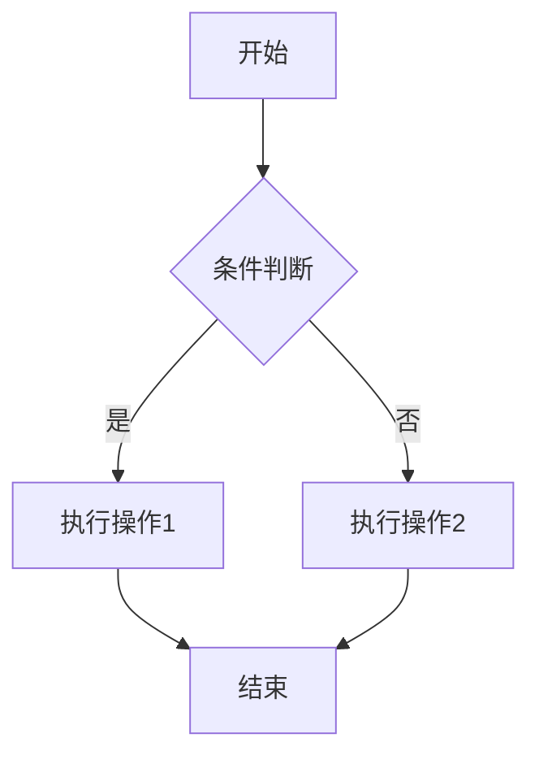
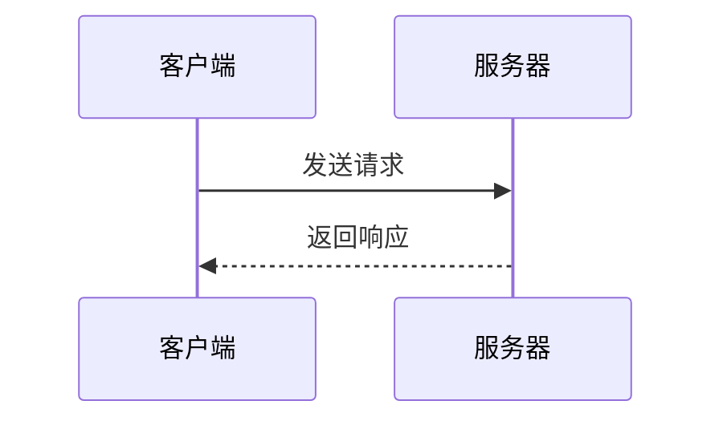
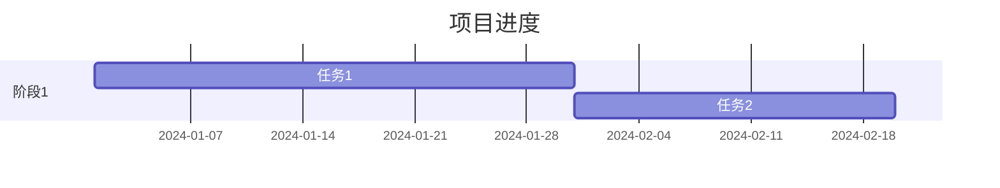

# FMC Markdown 组件

> feffery-markdown-components (fmc) - Markdown 渲染组件库完整指南
> 支持代码高亮、LaTeX 公式、Mermaid 图表等扩展语法

---

## 组件库概述

**feffery-markdown-components**（简称 `fmc`）是基于 `react-markdown` 的 Plotly Dash 第三方组件库，用于将原始 Markdown 文本直接渲染为美观的网页内容。

### 基本信息

| 属性 | 值 |
|------|-----|
| 包名 | `feffery-markdown-components` |
| 简称 | `fmc` |
| 最新版本 | `0.4.2` |
| Python 依赖 | `dash>=3.1.1` |
| 官方文档 | http://fmc.feffery.tech/ |
| GitHub | https://github.com/CNFeffery/feffery-markdown-components |

### 版本兼容性

| fmc 版本 | 适用 Dash 版本 |
|:--------:|:--------------:|
| >=0.4.0  | >=3.0.0        |
| <0.4.0   | <3.0.0         |

### 安装

```bash
pip install feffery-markdown-components -U
```

---

## 组件列表

### 1. FefferyMarkdown

**功能**：主 Markdown 渲染组件，支持完整的 Markdown 语法渲染。

**主要特性**：
- 标准 Markdown 语法 + GFM (GitHub Flavored Markdown)
- LaTeX 数学公式渲染 (`$...$` / `$$...$$`)
- Mermaid 图表支持
- 代码语法高亮（26 种主题）
- 图片预览和自定义
- 外部链接安全检查
- 关键词高亮搜索
- 自动生成目录锚点

### 2. FefferySyntaxHighlighter

**功能**：独立的代码语法高亮组件，支持多种编程语言和代码差异对比。

**主要特性**：
- 多语言代码高亮
- 26 种代码主题
- 行号显示 + 复制按钮
- **代码差异对比（Diff 模式）** - 标记新增/删除行

---

## 基础用法

### 简单渲染

```python
import dash
from dash import html
import feffery_markdown_components as fmc

app = dash.Dash(__name__)

app.layout = html.Div([
    fmc.FefferyMarkdown(
        markdownStr='''
# 标题

这是一段**加粗**和*斜体*文本。

## 列表

- 项目 1
- 项目 2
- 项目 3

## 代码

```python
def hello():
    print("Hello, World!")
```
        '''
    )
])

if __name__ == '__main__':
    app.run()
```

### 从文件加载

```python
with open('README.md', 'r', encoding='utf-8') as f:
    markdown_content = f.read()

fmc.FefferyMarkdown(markdownStr=markdown_content)
```

---

## 代码主题列表（26种）

两个组件均支持以下代码主题：

| 主题名称 | 风格描述 |
|----------|----------|
| `gh-colors` | GitHub 风格（**默认**） |
| `a11y-dark` | 无障碍暗色主题 |
| `atom-dark` | Atom 编辑器暗色 |
| `coldark-cold` | Coldark 冷色 |
| `coldark-dark` | Coldark 暗色 |
| `coy` | Coy 主题 |
| `coy-without-shadows` | Coy 无阴影 |
| `darcula` | Darcula 主题 |
| `dracula` | Dracula 暗色 |
| `nord` | Nord 主题 |
| `okaidia` | Okaidia 主题 |
| `prism` | Prism 默认 |
| `solarizedlight` | Solarized 亮色 |
| `twilight` | Twilight 暮光 |
| `duotone-sea` | 双色海洋 |
| `duotone-dark` | 双色暗黑 |
| `duotone-light` | 双色亮色 |
| `duotone-space` | 双色太空 |
| `gruvbox-dark` | Gruvbox 暗色 |
| `material-dark` | Material 暗色 |
| `night-owl` | 夜猫子主题 |
| `one-light` | One Light 主题 |
| `pojoaque` | Pojoaque 主题 |
| `solarized-dark-atom` | Solarized 暗色 Atom |
| `synthwave84` | Synthwave 84 |
| `z-touch` | Z-Touch 主题 |

### 使用示例

```python
fmc.FefferyMarkdown(
    codeTheme='dracula',
    showLineNumbers=True,
    showCopyButton=True,
    markdownStr="""
```python
def factorial(n):
    return 1 if n <= 1 else n * factorial(n - 1)
```
"""
)
```

---

## Markdown 文档主题（6种）

| 主题名称 | 说明 |
|----------|------|
| `markdown-body` | GitHub 风格（默认） |
| `theme-drake` | Drake 主题 |
| `theme-drake-juejin` | Drake 掘金风格 |
| `theme-forest` | 森林主题 |
| `theme-blubook` | Blubook 主题 |
| `theme-pie` | Pie 主题 |

```python
fmc.FefferyMarkdown(
    markdownBaseClassName='theme-drake',
    markdownStr="..."
)
```

> **注意**：使用非默认主题需要在应用中引入对应的 CSS 文件。

---

## LaTeX 数学公式

```python
fmc.FefferyMarkdown(
    markdownStr=r"""
## 数学公式

行内公式：$E = mc^2$

独立公式：

$$
\int_{-\infty}^{\infty} e^{-x^2} dx = \sqrt{\pi}
$$

矩阵：

$$
\begin{pmatrix}
a & b \\
c & d
\end{pmatrix}
$$
    """
)
```

---

## Mermaid 图表

**重要**：使用 Mermaid 需要先引入静态资源！

```python
# 引入 Mermaid 静态资源
app = dash.Dash(
    __name__,
    external_scripts=[
        "https://registry.npmmirror.com/mermaid/latest/files/dist/mermaid.min.js"
    ],
)

fmc.FefferyMarkdown(
    mermaidOptions=True,
    markdownStr="""
## 流程图



## 时序图



## 甘特图


    """
)
```

---

## 自动生成目录

```python
from dash import html, callback, Input, Output
import feffery_antd_components as fac

html.Div([
    html.Div(id='toc-container'),
    fmc.FefferyMarkdown(
        id='markdown-content',
        titleAsId=True,  # 关键参数：标题作为ID
        markdownStr="# 标题1\n## 标题2\n### 标题3"
    )
])

@callback(
    Output('toc-container', 'children'),
    Input('markdown-content', 'facAnchorLinkDict')  # 自动生成的目录结构
)
def update_toc(anchorDict):
    if anchorDict:
        return fac.AntdAnchor(linkDict=anchorDict)
    return None
```

---

## 代码差异对比（FefferySyntaxHighlighter）

```python
fmc.FefferySyntaxHighlighter(
    codeString="""
import dash_html_components as html
import dash_core_components as dcc
from dash.dependencies import Input, Output, State
from dash import (
    html, dcc, Input, Output, State
)

app = dash.Dash(__name__)
""",
    language='python',
    removedLineNumbers=[2, 3, 4],  # 标记为删除的行（红色）
    addedLineNumbers=[5, 6, 7],    # 标记为新增的行（绿色）
    showLineNumbers=True,
)
```

---

## 外部链接安全检查

```python
fmc.FefferyMarkdown(
    checkExternalLink=True,
    safeRedirectUrlPrefix='/safe-redirect?target=',
    externalLinkPrefixWhiteList=['http://fac.feffery.tech'],
    markdownStr="""
[内部链接](/about)
[白名单链接](http://fac.feffery.tech/)
[外部链接](https://github.com/)  # 会跳转到安全中转页
"""
)
```

---

## FefferyMarkdown 属性速查

| 分类 | 属性 | 说明 |
|------|------|------|
| **基础** | `markdownStr` | Markdown 内容字符串 |
| | `children` | 强制渲染内容（优先级最高） |
| | `placeholder` | 空内容时的占位内容 |
| | `locale` | 语种：`'zh-cn'` / `'en-us'` |
| **代码块** | `codeTheme` | 代码主题（默认 'gh-colors'） |
| | `showLineNumbers` | 显示行号 |
| | `showCopyButton` | 显示复制按钮 |
| | `codeBlockStyle` | 代码块样式 |
| | `codeFallBackLanguage` | 缺省代码语言 |
| | `wrapLongLines` | 超长行换行 |
| **图片** | `imagePreview` | 图片预览功能 |
| | `imageFallback` | 加载失败占位图 |
| | `imageForceAlignCenter` | 强制居中 |
| **表格** | `forceTableAlignCenter` | 表格居中 |
| | `forceTableHeaderTextAlignCenter` | 表头文字居中 |
| **链接** | `linkTarget` | 跳转方式：`'_blank'` / `'_self'` |
| | `checkExternalLink` | 外部链接安全检查 |
| | `safeRedirectUrlPrefix` | 安全中转 URL 前缀 |
| | `externalLinkPrefixWhiteList` | 白名单链接前缀 |
| **HTML** | `renderHtml` | 渲染原始 HTML |
| **目录** | `titleAsId` | 标题作为 ID（用于目录生成） |
| | `facAnchorLinkDict` | 自动生成的目录结构 (Output) |
| **搜索** | `searchKeyword` | 搜索关键词 |
| | `highlightStyle` | 高亮样式 |
| **Mermaid** | `mermaidOptions` | Mermaid 图表配置 (bool/dict) |
| **文档主题** | `markdownBaseClassName` | 文档主题类名 |

---

## FefferySyntaxHighlighter 属性速查

| 分类 | 属性 | 说明 |
|------|------|------|
| **必填** | `codeString` | 代码内容字符串 |
| | `language` | 编程语言 |
| **主题** | `codeTheme` | 代码主题 |
| **显示** | `showLineNumbers` | 显示行号 |
| | `showCopyButton` | 显示复制按钮 |
| | `wrapLongLines` | 超长行换行 |
| **样式** | `codeBlockStyle` | 代码块样式 |
| | `codeStyle` | 代码内容样式 |
| **Diff** | `addedLineNumbers` | 新增行下标列表 |
| | `removedLineNumbers` | 删除行下标列表 |
| | `addedLineStyle` | 新增行样式 |
| | `removedLineStyle` | 删除行样式 |

---

## 参考资源

- [FMC 官方文档](http://fmc.feffery.tech/)
