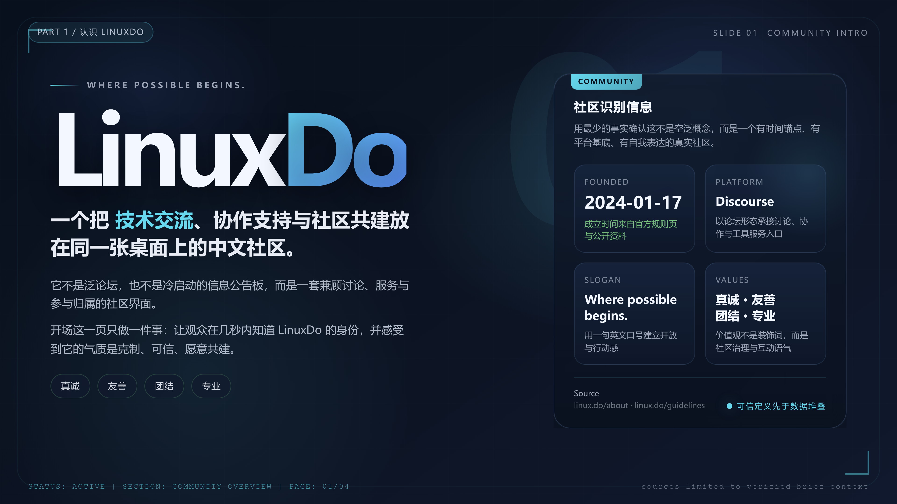
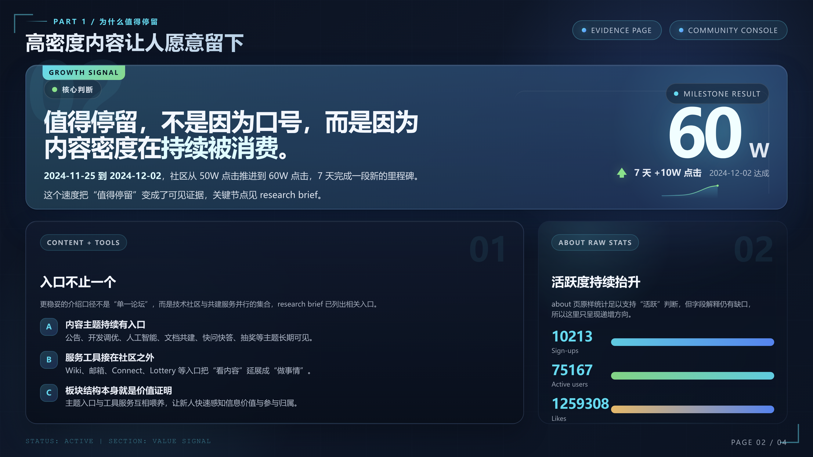
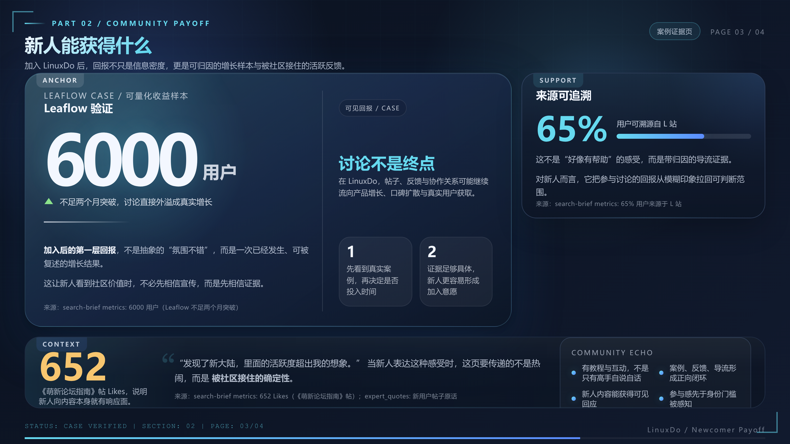
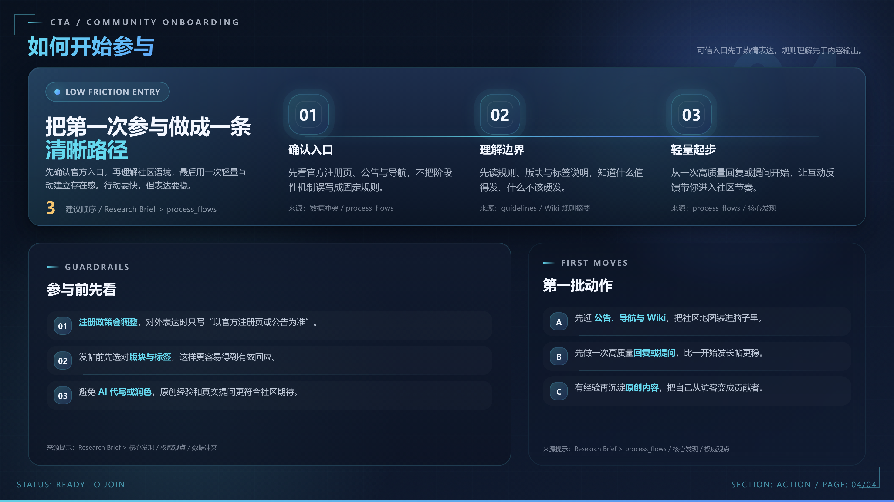

<div align="center">
  
  <h1>PPT Agent</h1>
  <p>基于软件工程理念的演示文稿全自动生成框架</p>
  <p><a href="README_EN.md">English</a> | 中文</p>

  <p>
    <a href="#快速开始"></a>
    <a href="LICENSE"></a>
  </p>

  <p>
    
    
    
    
    
    
  </p>
</div>

---

**PPT Agent** 以严格的状态机驱动多 Agent 协作，将一句话需求输出为专业级 PPTX 文件，从根源解决传统大模型生成的幻觉、重叠与布局混乱问题。

## 安装

```
npx skills add sunbigfly/ppt-agent-skills
```


## 核心亮点

**Subagent 阶段隔离**：Research / Outline / Style / Planning 四大阶段各自运行独立的子代理，Context 不互染。每个子代理创建时强制携带 `SUBAGENT_MODEL` 参数，禁止走默认回退。

**像素级 Visual QA 闭环**：每页 HTML 构建后自动截图，由大模型进行视觉审计。检测到布局溢出后，子代理以 DOM + CSS 结构重写的方式消除冲突，而非依赖间距微调。

**PPTX 导出安全护栏**：Step 4 额外注入导出安全区与 HTML 兼容规则，减少“浏览器里正常、落到 PPTX 里炸版”的高风险实现。

**无状态断点恢复**：全流程不依赖任何进度状态文件。中断后通过扫描磁盘上已存在的产物文件（`outline.txt` / `style.json` / `slide-N.png` 等）自动推断恢复点。

**数据层与渲染层隔离**：每页先生成并由 `planning_validator.py` 通过校验的 JSON 合同，再驱动 HTML 渲染。写入前校验拦截所有结构错误，不进入渲染流程。

**单页简报 / Executive One-pager**：当用户要求“1 页 PPT”“给老板一页看完”“one-page briefing”时，系统会跳过传统多页骨架，使用高密度但可读的 one-pager 结构，把结论、KPI、证据、风险和行动建议压缩到一页闭环简报。

**双引擎 PPTX 导出**：PNG 光栅流保证跨平台 100% 视觉还原；SVG 矢量流保留字体可独立编辑，并可将高频图表块逐步提升为原生对象或命名原生组合（当前已覆盖 `comparison_bar`、`progress_bar`、`stacked_bar`、`sparkline`、`rating`、`kpi`、`ring`、`metric_row`、`timeline`、`funnel`、`radar`）。

## 图表能力矩阵

当前运行时已经把 planning 可选性与 PPTX 导出层级收敛到同一套口径：

| `chart_type` | Planning 默认状态 | PPTX 当前落地层级 |
|-------------|-------------------|-------------------|
| `comparison_bar` | 默认可选 | 真实 PPT chart |
| `progress_bar` | 默认可选 | 真实 PPT chart |
| `stacked_bar` | 默认可选 | 真实 PPT chart |
| `sparkline` | 默认可选 | 命名原生 / 原生化 group |
| `rating` | 默认可选 | 命名原生 / 原生化 group |
| `kpi` | 默认可选 | 命名原生 / 原生化 group |
| `ring` | 默认可选 | 命名原生 / 原生化 group |
| `metric_row` | 默认可选 | 命名原生 / 原生化 group |
| `timeline` | 默认可选 | 命名原生 / 原生化 group |
| `funnel` | 默认可选 | 命名原生 / 原生化 group |
| `radar` | 默认可选 | 命名原生 / 原生化 group |
| `treemap` | 默认可选 | 命名原生 / 原生化 group |
| `waffle` | 默认可选 | 命名原生 / 原生化 group |

说明：

- 默认可选图表可以直接进入 planning，并按 editable PPTX 的默认高编辑性路径落地。
- `treemap`、`waffle` 现在也会提升为 `NativeChart:*` 命名原生 group，不再要求显式接受 fallback。

## 工作流

```
P0 采访   →  P1 分支确认
P2A 联网检索 / P2B 本地资料压缩
P3 叙事大纲  →  P3.5 全局风格锁定
P4 逐页并行生产（Planning → HTML → Visual QA）
P5 演讲稿生成 + Preview + 双 PPTX 导出
```

每个阶段产物落盘后经 Gate 校验放行，失败只回退当前步，不影响其他页进度。

## 产物链

```
interview-qa.txt → requirements-interview.txt
  → search-brief.txt | source-brief.txt
  → outline.txt → style.json
  → planningN.json → slide-N.html → slide-N.png
  → speech-script.json → speech-script.md
  → preview.html → svg-export-report.json + slide-*.semantic.json(block/table/chart regions) → presentation-svg.report.json
  → presentation-{png,svg}.pptx → presentation-svg.inspect.json

`svg2pptx.py` 现在也支持基于现有模板 PPTX 的 block-level 局部改写：通过 `--template-pptx <deck.pptx> --target-slides 2,5,7` 可以仅替换指定页里匹配 `data-card-id` 的 managed block，并保留原 deck 的主题、母版、页背景以及未命中的既有元素。模板页若预先把可替换占位对象命名为 `BlockSlot:<block_id>:...`，导出时会只清掉对应 block 的旧对象；再次更新时，之前导出的 managed shape 会以 `Block:<block_id>:...`、`ChartGroup:...:block=<block_id>`、`NativeChart:...:block=<block_id>` 自动被精准替换。`presentation-svg.report.json` 与 `presentation-svg.inspect.json` 会按真实目标页号输出 structured chart hit-rate，并额外记录 updated block / removed shape 统计。
```

## 模板更新指南

如果你要在保留原 deck 主题、母版和背景的前提下只改指定页内容，先看 [references/design-runtime/pptx-template-update-authoring.md](references/design-runtime/pptx-template-update-authoring.md)。这份文档把模板页命名合同、CLI 调用方式、重跑替换语义和常见失败模式都写成了可直接照着做的作者指南。

## 效果示例

<details>
  <summary>点击展开渲染参照</summary>
  <div align="center">
    <br/>
    
    
    
    
  </div>
</details>

## 快速开始

本项目以 Agent Skill 形式运行，无需独立部署。在支持 Skill 的代理环境中直接输入需求即可触发完整流程：

> *"帮我生成一份关于 2026 年具身智能发展趋势的 15 页路演 Deck，暗色科技风格。"*

单页简报示例：

> *"帮我做一页给老板看的 AI 项目周报简报，信息密度高但可读，要包含结论、KPI、风险和下一步。"*

所有产物输出至 `ppt-output/runs/<RUN_ID>/`，包含网页预览、speech-script.md 以及双格式 PPTX。

## 仓库结构

```
ppt-agent-skill/
├── SKILL.md          # 主控制台：状态机、Gate、恢复规则
├── scripts/          # 执行脚本（validator / harness / exporter）
├── references/       # 按需挂载的 Markdown 知识源
│   ├── playbooks/    # 各阶段子代理执行手册
│   ├── styles/       # 主题风格规范
│   ├── layouts/      # 版式资源
│   ├── charts/       # 图表模板
│   └── blocks/       # UI 组件
└── assets/
```

## 友情链接

已链接认可 [LINUX DO 社区](https://linux.do) 的友情链接。

## License

[MIT](LICENSE)
